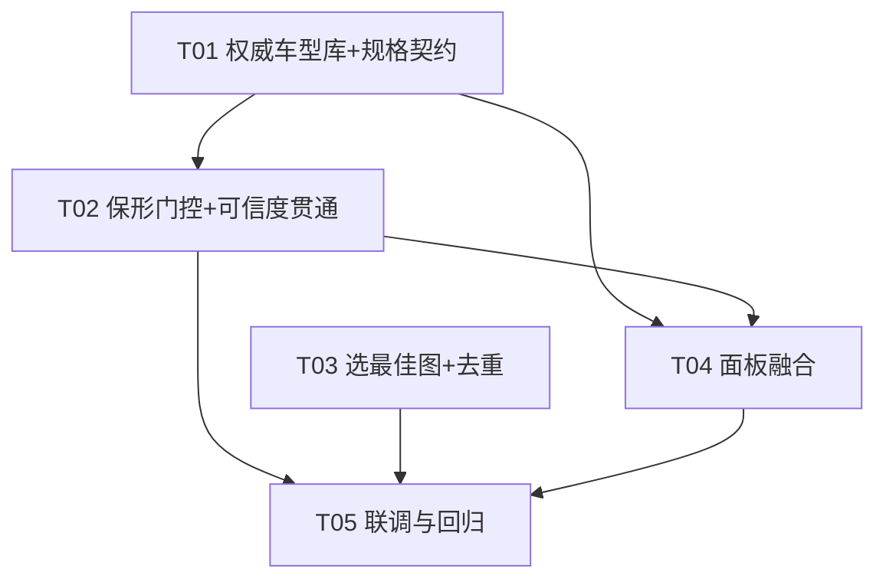

# 增量设计：车型识别真实化 + 保形 + 车身数据面板融合

> 架构师：高见远（Bob / software-architect）
> 项目：灵感改装 / INSPIRATION GARAGE（Vite + 原生 JS ESM + Three.js，3D 后端 Hyper3D Rodin，自动 BANG 拆解）
> 范围：问题 A（视觉识别结果不现实，根因）＋ 问题 B（右上角浮窗面板融合进「车身」tab）
> 配套文档：`docs/car-specs-shape-class.mermaid`、`docs/car-specs-shape-seq.mermaid`

---

## 0. 设计目标与总路线（用户拍板：两者都做）

1. **保形（Shape-Preserving）**：不再对图生 3D 网格做非等比宽高校正。图生 3D 的自然比例保留，"看起来真实"。只有在「规格来自权威库」或「高置信度且网格实测比例偏差在阈值内」时才允许按真车宽高校正；其余一律只等比缩放到车长。
2. **权威车型库（Official DB）**：新增本地真实车型参数 JSON 库。识别到的车优先查库拿验证过的尺寸；查不到再退回大模型（LLM）。结果最准、且可扩展（后续手动加车）。

> 说明：本设计**只给设计 / 接口契约 / 文件清单 / 任务顺序**，不含完整实现代码。代码块仅用于标注契约、schema 与最小伪片段。

---

## 1. 问题 B 方案：车身数据面板融合

### 1.1 目标落点
- 删除 `#stage` 内的右上角浮动 `#body-data`（不遮挡车模）。
- 在「车身」tab（`tabBodies.body`）**顶部**新增一块只读静态卡片（`#body-info`），复用现有 `renderBodyData` 的 rows 与数据字段。
- `syncAll()` 继续调用渲染函数，刷新时机不变。

### 1.2 要改的文件
| 文件 | 改动 |
|---|---|
| `index.html` | 删除 `#stage` 内第 58–66 行的 `#body-data` 浮动节点 |
| `src/ui/styles.css` | 删除 `.body-data` 绝对定位块（约 793–851 行）与霓虹覆盖块（约 1542–1556 行）；新增 `.body-info` 系列（sidebar 内联卡片，无 `position:absolute`） |
| `src/ui/panel.js` | 新建 `#body-info` DOM 节点并 `insertBefore` 到 `tabBodies.body` 顶部；改写 `renderBodyData()` 渲染进 `#body-info`；`syncAll()` 仍调用之 |

### 1.3 DOM 改动
**删除**（`index.html`）：
```html
<!-- 原：<main id="stage"> 内 -->
<div id="body-data" class="body-data hidden"> … </div>
```
**新增**（由 `panel.js` 在构建期注入到 `tabBodies.body` 顶部，无需改 `index.html`）：
```html
<section class="panel-section">
  <h3 class="panel-section__title">车型数据摘要</h3>
  <div id="body-info" class="body-info">
    <div class="body-info__head">
      <span class="body-info__name">—</span>
      <span class="body-info__conf"></span>      <!-- 车名识别把握度 -->
    </div>
    <div class="body-info__src"></div>            <!-- 来源徽章 + 参数可信度 -->
    <div class="body-info__grid"></div>           <!-- L/W/H/轴距/轮距/离地/角度 -->
  </div>
</section>
```
> 注入位置：`panel.js` 在 `const tabBodies = {...}` 之后、首个 `tabBodies.body.appendChild(...)` 之前，用
> `tabBodies.body.insertBefore(section('车型数据摘要', bodyInfoEl), tabBodies.body.firstChild)`，确保它永远在「车身」tab 最上方。

### 1.4 CSS 改动（契约）
- **删除**：`.body-data` / `.body-data.hidden` / `.body-data__head/__name/__conf/__grid/__src` 以及霓虹主题里的 `.body-data{...}` 覆盖块（1542–1556）。
- **新增**（全部去绝对定位，跟随 sidebar 滚动）：
```css
.body-info {
  padding: 10px 12px;
  border: 1px solid var(--line, #232a33);
  border-radius: 12px;
  background: rgba(17, 20, 25, 0.6);
  color: var(--text, #e7ebf0);
  font-size: 12px;
}
.body-info__head { display:flex; align-items:baseline; justify-content:space-between; gap:8px; margin-bottom:6px; }
.body-info__name { font-size:14px; font-weight:700; color:#fff; }
.body-info__conf { font-size:11px; color:var(--accent,#5cc8ff); white-space:nowrap; }
.body-info__src  { font-size:10.5px; color:var(--text-faint,#5b6573); margin-bottom:8px; }
.body-info__src.is-official { color:#5fe39a; }      /* 官方库命中：绿 */
.body-info__src.is-llm { color:#ffcf6b; }           /* 大模型估算：琥珀 */
.body-info__grid { display:grid; grid-template-columns:auto 1fr; gap:3px 10px; }
.body-info__grid .k { color:var(--text-dim,#9aa4b2); }
.body-info__grid .v { text-align:right; font-variant-numeric:tabular-nums; }
```
> 霓虹主题（`.theme-neon` 下）沿用现有变量，仅保留 `var(--neon-cyan)` 描边，不必再单独覆盖 `.body-info`（变量已接管）。

### 1.5 `renderBodyData()` 改写契约（伪片段，非实现）
```js
const bodyInfoEl = document.getElementById('body-info');
function renderBodyData() {
  const rs = app.params.realSpecs;
  if (!bodyInfoEl) return;
  if (!rs || !rs.length) { bodyInfoEl.classList.add('is-empty'); /* 显示占位 */ return; }
  bodyInfoEl.classList.remove('is-empty');

  // 车名识别把握度（来自视觉，独立字段）
  bodyInfoEl.querySelector('.body-info__name').textContent = rs.fullName || rs.query || '已识别车型';
  bodyInfoEl.querySelector('.body-info__conf').textContent =
    rs.nameConfidence ? `车名把握 ${Math.round(rs.nameConfidence * 100)}%` : '';

  // 参数来源 + 参数可信度（与车名把握分离）
  const src = bodyInfoEl.querySelector('.body-info__src');
  const isOfficial = rs.source === 'official-db';
  src.className = 'body-info__src ' + (isOfficial ? 'is-official' : 'is-llm');
  src.textContent = isOfficial
    ? `来源：官方车型库 · 参数可信度 ${Math.round((rs.confidence ?? 0.95) * 100)}%`
    : `来源：大模型估算 · 参数可信度 ${Math.round((rs.confidence ?? 0) * 100)}%`;

  // 复用原 rows：车长/车宽/车高/轴距/前后轮距/离地/接近离去角
  const rows = [ ['车长', mm(rs.length)], ['车宽', mm(rs.width)], ['车高', mm(rs.height)],
    ['轴距', mm(rs.wheelbase)],
    ['前/后轮距', rs.trackFront||rs.trackRear ? `${rs.trackFront||'—'} / ${rs.trackRear||'—'}` : '—'],
    ['离地间隙', mm(rs.groundClearance)],
    ['接近/离去角', `${deg(rs.approachAngle)} / ${deg(rs.departureAngle)}`] ];
  bodyInfoEl.querySelector('.body-info__grid').innerHTML =
    rows.map(([k,v]) => `<span class="k">${k}</span><span class="v">${v}</span>`).join('');
}
```
`syncAll()` 不变（继续调用 `renderBodyData()`）。`#body-data` 旧 DOM 删除后，旧 `renderBodyData` 内 `document.getElementById('body-data')` 判空逻辑随之移除。

### 1.6 车身 tab 内静态卡片字段与布局
```
┌ 车型数据摘要 ────────────────────────────┐
│ 奔驰 SL 350 (R230)       车名把握 92%      │  ← 车名识别置信度（视觉）
│ 来源：官方车型库 · 参数可信度 95%           │  ← 来源徽章 + 参数可信度（绿）
│ ──────────────────────────────────────   │
│ 车长        4535 mm                       │
│ 车宽        1817 mm                       │
│ 车高        1290 mm                       │
│ 轴距        2560 mm                       │
│ 前/后轮距   1535 / 1527 mm                │
│ 离地间隙    120 mm                        │
│ 接近/离去角 12° / 14°                     │
└───────────────────────────────────────────┘
```
- 无数据时：卡片显示"尚未识别到车型（上传整车照片后显示真实尺寸）"，不报错。
- 大模型来源时来源行变琥珀，并提示"估算值，可在下方滑杆微调"。

---

## 2. 问题 A 方案

### 2.a 后端权威库：`server/specs.js` 改造 + 本地 JSON 库

#### 2.a.1 库文件与落盘位置（契约）
- 种子库：`server/carSpecs.db.json`（提交 git，受版本管理）。
- 用户扩展库（可选）：`server/carSpecs.user.db.json`（**gitignore**，手动加车，加载时覆盖种子）。
- 加载：`specs.js` 启动时 `import` 种子（或 `fs.readFileSync` 懒加载），并与 user 库 `merge`（user 优先）。**合并策略**：按 `key` 去重，user 条目覆盖同 key 种子。

> 落盘是否进 git 见 §6 待明确事项（风险点）。当前默认建议：种子进 git，user 库 gitignore。

#### 2.a.2 JSON Schema（契约）
```jsonc
// server/carSpecs.db.json
{
  "version": 1,
  "updated": "2026-08-27",
  "cars": [
    {
      "key": "mercedes-sl350-r230",
      "brand": "奔驰",
      "model": "SL 350",
      "yearRange": "2002-2011",
      "aliases": ["奔驰SL350","奔驰 SL 350","奔驰SL 350 R230",
                  "Mercedes SL350","Mercedes-Benz SL350 R230","SL350 R230"],
      "specs": {
        "length": 4535, "width": 1817, "height": 1290,
        "wheelbase": 2560, "trackFront": 1535, "trackRear": 1527,
        "groundClearance": 120, "approachAngle": 12, "departureAngle": 14,
        "rimInch": 18, "tireWidth": 255, "aspect": 45
      },
      "source": "official-db",
      "note": "厂商公开参数"
    }
  ]
}
```
字段单位：**长度 mm、角度 °、轮毂直径 inch、胎宽 mm、扁平比 %**（与现有 `RANGE` 校验一致）。

#### 2.a.3 匹配算法契约（模糊匹配 normalized 车型名）
```
normalizeName(s):
  - toLowerCase
  - 去空格与标点（保留字母数字）
  - 品牌同义归一：奔驰↔mercedes(benz) / 宝马↔bmw / 丰田↔toyota /
    本田↔honda / 保时捷↔porsche / 福特↔ford / 特斯拉↔tesla /
    路虎↔landrover / 大众↔vw / 奥迪↔audi

lookupOfficialDb(query):
  q = normalizeName(query)
  best = null
  for car in DB.cars:
    candidates = [normalizeName(car.key), ...car.aliases.map(normalizeName),
                  normalizeName(car.brand + car.model)]
    score = 0
    if q in candidates OR candidates includes q: score = 1.0      // 精确/别名
    else if brandModelNorm(car) is substring of q: score = 0.85  // 核心车型命中
    if score >= 0.85 and score > best.score: best = {car, score}
  return best   // null 表示未命中
```
> 模糊阈值 `0.85` 为初值，详见 §6 风险点（可调）。

#### 2.a.4 `carSpecs()` 改造契约（伪片段，非实现）
```js
export async function carSpecs(fullName, { year } = {}) {
  const name = String(fullName || '').trim();
  if (!name) return { available:false, reason:'error', detail:'缺少车型名' };

  // ① DB 优先
  const hit = lookupOfficialDb(name);
  const ESSENTIAL = ['length','width','height','wheelbase'];
  if (hit && ESSENTIAL.every(k => Number.isFinite(hit.specs[k]))) {
    return {
      available: true, ...spread(hit.specs),
      source: 'official-db',
      confidence: 0.95,          // 验证过 → 高可信（固定值，区别于 LLM 完整度）
      matchedKey: hit.key,
      query: fullName,
    };
  }

  // ② 退回现有 LLM（保持原 postChat / extractJson / sanitizeSpecs / RANGE 校验）
  const cfg = resolveChatConfig();
  if (!cfg) return { available:false, reason:'no-key' };
  ... // 现有 LLM 调用 + sanitizeSpecs + essential 校验
  return {
    available: true, ...spread(specs),
    source: 'model-llm',                                   // 原 '模型参数库（xxx）'
    confidence: fieldCompleteness(specs),                  // 字段越全越可信
    query: name,
  };
}
```
**对外契约不变**：`/api/specs` 入参 `{fullName, year?}`、出参形状不变；仅 `source` 取值新增 `'official-db'`，`confidence` 语义从"字段完整度"升级为"参数可信度"（official-db 固定 0.95）。

#### 2.a.5 初始种子车型清单建议（12 款，覆盖跑车/轿车/SUV/皮卡）
> 数值为厂商公开参数近似值（单位 mm / inch / %），**需 QA 复核**。

| key | 车型 | 类型 | L | W | H | WB | TF | TR | GC | AP° | DP° | rim | tireW | asp |
|---|---|---|---|---|---|---|---|---|---|---|---|---|---|---|
| mercedes-sl350-r230 | 奔驰 SL 350 (R230) | 跑车/敞篷 | 4535 | 1817 | 1290 | 2560 | 1535 | 1527 | 120 | 12 | 14 | 18 | 255 | 45 |
| toyota-gr-supra-a90 | 丰田 GR Supra (A90) | 跑车 | 4380 | 1865 | 1295 | 2470 | 1594 | 1589 | 110 | 11 | 14 | 19 | 255 | 35 |
| honda-nsx-nc1 | 本田 NSX (NC1) | 跑车 | 4470 | 1940 | 1215 | 2630 | 1655 | 1625 | 110 | 10 | 14 | 19 | 245 | 35 |
| porsche-911-carrera-992 | 保时捷 911 Carrera (992) | 跑车 | 4519 | 1852 | 1300 | 2450 | 1590 | 1555 | 110 | 10 | 13 | 20 | 245 | 35 |
| toyota-86-gr86 | 丰田 86 / GR86 | 轿跑 | 4265 | 1775 | 1310 | 2575 | 1520 | 1520 | 130 | 13 | 16 | 17 | 215 | 45 |
| bmw-3series-g20-330i | 宝马 3 系 330i (G20) | 轿车 | 4709 | 1827 | 1442 | 2851 | 1581 | 1602 | 140 | 14 | 16 | 18 | 225 | 45 |
| honda-civic-typer-fk8 | 本田 思域 Type R (FK8) | 两厢 | 4560 | 1878 | 1434 | 2700 | 1599 | 1585 | 120 | 12 | 18 | 20 | 245 | 30 |
| tesla-model3 | 特斯拉 Model 3 | 轿车 | 4694 | 1849 | 1443 | 2875 | 1584 | 1584 | 140 | 14 | 17 | 18 | 235 | 45 |
| toyota-rav4-xa50 | 丰田 RAV4 (XA50) | SUV | 4600 | 1855 | 1685 | 2690 | 1600 | 1610 | 195 | 18 | 22 | 17 | 225 | 65 |
| honda-crv-rw | 本田 CR-V (RW) | SUV | 4595 | 1855 | 1679 | 2660 | 1600 | 1610 | 208 | 19 | 23 | 18 | 235 | 60 |
| bmw-x5-g05 | 宝马 X5 (G05) | SUV | 4922 | 2004 | 1745 | 2975 | 1685 | 1690 | 211 | 22 | 25 | 19 | 275 | 45 |
| ford-f150 | 福特 F-150 (SuperCrew) | 皮卡 | 5907 | 2029 | 1961 | 3696 | 1712 | 1715 | 216 | 24 | 25 | 18 | 275 | 65 |

---

### 2.b 保形门控：`normalizeCar` 改造 + 调用方传参

#### 2.b.1 `normalizeCar` 新契约（伪片段，非实现）
```js
// src/core/glb.js
export function normalizeCar(g, {
  targetLength = 4.6,
  targetWidth = null,    // 米；为 null → 不校正宽
  targetHeight = null,   // 米；为 null → 不校正高
  groundY = 0,
  fit = 'auto',          // 'auto' | 'lengthOnly' | 'stretch'
} = {}) {
  // 1) 摆正；2) 等比缩放到 targetLength（不变）
  // 2b) 条件非等比校正：
  const canCorrect = targetWidth > 0.05 && targetHeight > 0.05 && fit !== 'lengthOnly';
  if (canCorrect) {
    const devW = targetWidth / size.z;   // 目标宽 / 实测宽
    const devH = targetHeight / size.y;  // 目标高 / 实测高
    const inRange = (v) => v >= DEV_LO && v <= DEV_HI;   // 默认 [0.85, 1.18]
    const allow = fit === 'stretch' ? true : (inRange(devW) && inRange(devH));
    if (allow) { corr.z = devW; corr.y = devH; g.scale.multiply(corr); }
    // 否则：保持纯等比（保形），不引入畸变
  }
  // 3) 居中 + 贴地（不变）
}
```
- `fit='auto'`（默认）：仅在 `targetWidth/Height` 给出**且**偏差 ∈ `[DEV_LO, DEV_HI]` 时校正 → 兼容旧调用（不给宽高 = 纯等比）。
- `fit='stretch'`：调用方已断定可信，强制校正（用于 official-db，仍受阈值兜底保护）。
- `fit='lengthOnly'`：永不校正宽高。

#### 2.b.2 调用方（`refitCar`）如何决定 ± 校正（契约）
```js
// src/main.js refitCar()
const rs = this.params.realSpecs;
const allowStretch =
  !!rs && (rs.source === 'official-db' || (rs.confidence >= CONF_HIGH && rs.source !== 'model-llm-fallback'));
const useWH = allowStretch && rs.width && rs.height;
normalizeCar(carInner, {
  targetLength: this.params.carLength,
  targetWidth:  useWH ? this.params.carWidth  : null,  // 不可信 → 传 null → 保形
  targetHeight: useWH ? this.params.carHeight : null,
  groundY: 0,
  fit: 'auto',
});
```
- 旧行为（无 `useWH` 门控）会直接把 LLM 猜的宽高拉进网格 → 畸变。新行为：不可信时传 `null`，网格保留图生 3D 自然比例（只锁车长）。
- `chassis.derive(...)` 仍用 `rs.wheelbase/track/groundClearance` 做四轮定位（2D 布局，不影响网格形变），保持"真车尺度"优势。

#### 2.b.3 阈值与降级逻辑（共享常量）
| 常量 | 默认 | 含义 |
|---|---|---|
| `CONF_HIGH` | `0.85` | 参数可信度（LLM）达到此值才允许非等比校正 |
| `DEV_LO` | `0.85` | 宽/高实测比相对目标比的下限 |
| `DEV_HI` | `1.18` | 宽/高实测比相对目标比的上限 |

> 偏差定义：`devW = targetWidth / 实测宽`（缩放后）；`devH = targetHeight / 实测高`。
> 阈值均为**初值**，需主理人确认（见 §6）。服务端/客户端各保留一份常量，**必须保持一致**（建议将来抽到共享常量模块，见风险点）。

---

### 2.c 识别用最佳照片：`recognize` 选图

#### 2.c.1 问题
`generate.js` `recognize()` 只发 `list[0]`，后端 `handleRecognize` 只取 `first.dataUrl` —— 5 张角度图里只用第 1 张，常是信息量最低的正前/正后，识别差。

#### 2.c.2 选图规则（契约）
- 角度优先级（来自 `photoGuide.js` 的 `ANGLES` id）：`side`(正侧方) > `frontRight`/`rearLeft`(45° 三/四分之三角) > `front`/`rear`(正前/正后) > 兜底 `list[0]`。
- **打标机制**：`photoGuide.js` 在组装 `files` 时给每个 `File` 写入 `file.angleId = angle.id`（如 `'side'`）。上传流程（非引导）的普通 `File` 无 `angleId` → 回退 `list[0]`（保持现状，无角度信息可凭）。
```js
// src/api/generate.js（伪片段）
const ANGLE_PRIORITY = { side:5, frontRight:4, rearLeft:4, front:2, rear:2 };
export function pickRecognitionImage(files) {
  const list = Array.from(files || []);
  if (!list.length) return null;
  const tagged = list
    .filter(f => f.angleId && ANGLE_PRIORITY[f.angleId] != null)
    .sort((a,b) => ANGLE_PRIORITY[b.angleId] - ANGLE_PRIORITY[a.angleId]);
  return tagged[0] || list[0];   // 有角度标签取最优；否则保持原 list[0]
}
export async function recognize(files) {
  const best = pickRecognitionImage(files);
  const dataUrl = await shrinkImage(best);
  // 其余不变：POST /api/recognize { images:[{dataUrl}] }
}
```
- 后端 `handleRecognize` 仍取 `first.dataUrl`（前端已选好最佳图，最小化后端改动）。若未来切多图视觉模型，可扩展为接收 `angle` 元数据由后端选——本期不做。
- 集成点：`photoGuide.js` 第 330 / 423 行 `ANGLES.map(a => filesById[a.id])` 处，给每个 `File` 附 `angleId = a.id` 后再传入识别/生成流程。

---

### 2.d 去掉重复识别：`enterPlan()` 去重

#### 2.d.1 问题
`main.js` 上传阶段（约 1790–1840）已 `recognize + fetchCarSpecs + applyRealSpecs` 并写入 `app.params.realSpecs`；`enterPlan()`（约 2418–2435）又对 `sourceFiles` 做了**第二次** `recognize + fetchCarSpecs`，浪费额度且结果可能漂移。

#### 2.d.2 方案
- **直接删除** `enterPlan` 内第 2418–2435 行的 `sourceFiles` 识别块（包含 `recognize`/`fetchCarSpecs`/`applyRealSpecs`/`panel.syncAll`）。
- 复用上传阶段已存入 `app.params.realSpecs`（同一 `app` 单例，跨阶段持久）。
- 兜底（可选，防上传阶段识别失败）：仅当 `!app.params.realSpecs?.length` 时才允许一次轻量回退识别——但默认按用户要求**整段删除**，避免额度浪费。

```js
// src/main.js enterPlan() —— 删除以下整段：
// if (sourceFiles?.length && !isPresetCarUrl(...)) { await recognize(...); await fetchCarSpecs(...); ... }
// 改为：直接使用 app.params.realSpecs 驱动轮位/悬挂（已在 applyPlanToApp / loadPlanCar 中生效）
```

---

### 2.e 置信度分离（车名识别 vs 参数可信度）

| 字段 | 来源 | 含义 | 展示位置 |
|---|---|---|---|
| `nameConfidence` | 视觉 `rec.confidence` | 车名识别把握度 | 卡片右上角"车名把握 X%" |
| `source` | `carSpecs()` | `'official-db'` / `'model-llm'` | 来源徽章（绿/琥珀） |
| `confidence` | `carSpecs()` | 参数可信度：official-db=0.95，LLM=字段完整度 | 来源行"参数可信度 X%" |

- 改造点：
  1. `applyRealSpecs(s, opts = {})` 新增第二参 `opts.nameConfidence`，写入 `realSpecs.nameConfidence`（原 `confidence` 字段保留为**参数可信度**，不再被误当"车名把握"）。
  2. 上传阶段调用：`app.applyRealSpecs(sp, { nameConfidence: rec.confidence })`（在 `main.js` 约 1814 行附近补 `nameConfidence`）。
  3. `panel.js` 渲染：车名把握读 `nameConfidence`，参数可信度读 `confidence` + `source`（见 §1.5）。
- 向后兼容：旧 `realSpecs` 无 `nameConfidence` 时卡片不显示"车名把握"行（不报错）。

---

## 3. 文件清单（按模块）

| 模块 | 文件 | 改动类型 |
|---|---|---|
| 权威库 | `server/carSpecs.db.json` | 新增（种子，进 git） |
| 权威库 | `server/carSpecs.user.db.json` | 新增（空壳/忽略，gitignore） |
| 后端规格 | `server/specs.js` | 改：`lookupOfficialDb` / `normalizeName` / `carSpecs` DB-first |
| 保形 | `src/core/glb.js` | 改：`normalizeCar` 增加 `fit` + 阈值门控 |
| 保形/参数 | `src/main.js` | 改：`applyRealSpecs`（存 `nameConfidence`）、`refitCar`（传 `fit`/`useWH`）、上传阶段写 `nameConfidence`、删除 `enterPlan` 重复识别 |
| 选图 | `src/api/generate.js` | 改：`recognize` + `pickRecognitionImage` |
| 选图 | `src/ui/photoGuide.js` | 改：给 `File` 打 `angleId`（330/423 行） |
| 面板 | `index.html` | 删：第 58–66 行 `#body-data` |
| 面板 | `src/ui/styles.css` | 删：`793–851` + `1542–1556`；增 `.body-info` 系列 |
| 面板 | `src/ui/panel.js` | 改：`#body-info` 注入 + `renderBodyData` 改写（保留 `syncAll`） |
| 联调 | `scripts/_qa-car-specs-shape.mjs` | 新增（QA 端到端脚本，可选） |

---

## 4. 有序任务清单

> 按模块分组，不超过 5 个任务；T01 为共享基础数据/契约层（所有下游依赖），T02 与 T03 可并行，T04 依赖 T01/T02，T05 最后联调。

### T01 — 基础数据层：权威车型库 + 规格查询契约（P0）
- 源文件：`server/carSpecs.db.json`、`server/carSpecs.user.db.json`、`server/specs.js`
- 依赖：无
- 内容：建库（12 款种子）+ `lookupOfficialDb` / `normalizeName` / `carSpecs` DB-first 改造；`source` 新增 `'official-db'`、`confidence` 语义升级。
- 出口契约：`carSpecs(fullName,{year})` 出参 `source`/`confidence` 新语义；`/api/specs` 接口不变。

### T02 — 保形门控 + 参数可信度贯通（P0）
- 源文件：`src/core/glb.js`、`src/main.js`
- 依赖：T01（`source` 字段）
- 内容：`normalizeCar` 增加 `fit` + `DEV_LO/HI` 门控；`refitCar` 按 `source`/`confidence` 决定 `useWH`；`applyRealSpecs` 存 `nameConfidence`；上传阶段写入 `nameConfidence`。
- 出口：网格在不可信时保形（纯等比锁车长）；可信时按真实宽高校正。

### T03 — 识别选最佳图 + 去重（P1）
- 源文件：`src/api/generate.js`、`src/ui/photoGuide.js`、`src/main.js`
- 依赖：T02（仅 `nameConfidence` 打通，可与 T02 并行开发）
- 内容：`pickRecognitionImage`（按 `angleId` 优先侧方/45°）；`photoGuide` 给 `File` 打 `angleId`；删除 `enterPlan` 重复识别块。
- 出口：识别用信息量最大图；进入工作室不再二次扣额度。

### T04 — 车身数据面板融合（P1）
- 源文件：`index.html`、`src/ui/styles.css`、`src/ui/panel.js`
- 依赖：T01（`source` 字段）、T02（`nameConfidence` 字段）
- 内容：删 `#body-data` 浮窗；新增 `.body-info` 卡片进「车身」tab 顶部；`renderBodyData` 改写渲染进 `#body-info`，区分车名把握 / 参数可信度 / 来源。
- 出口：不遮挡车模，只读摘要与滑杆同 tab。

### T05 — 联调与回归（P0，收尾）
- 源文件：`scripts/_qa-car-specs-shape.mjs`（新增）+ 现有 QA 脚本
- 依赖：T01–T04
- 内容：端到端用例——① DB 命中（保形+绿来源）；② DB 未命中退回 LLM（琥珀+仅锁车长）；③ 偏差超阈值降级；④ 面板不遮挡；⑤ 进入工作室无二次 `/api/recognize` 请求；⑥ `nameConfidence` 与 `confidence` 分别展示正确。
- 出口：QA 严过关用例全绿。

### 任务依赖图


---

## 5. 共享知识（跨任务约定，供工程师遵循）

- **单位**：长度 mm、角度 °、轮毂 inch、胎宽 mm、扁平比 %（与 `RANGE` 校验一致）。
- **`source` 取值**：`'official-db'`（验证过，绿）、`'model-llm'`（大模型估算，琥珀）、历史值 `'模型参数库（xxx）'` 视作 LLM。
- **`confidence` 语义**：今后一律表示"参数可信度"；official-db 固定 `0.95`，LLM 为字段完整度。车名把握另用 `nameConfidence`。
- **阈值常量**：`CONF_HIGH=0.85`、`DEV_LO=0.85`、`DEV_HI=1.18`；服务端（`specs.js`）与客户端（`glb.js`/`main.js`）各一份，**必须保持一致**。
- **匹配阈值**：`lookupOfficialDb` 命中阈值 `0.85`，模糊匹配仅做归一+核心车型子串，不做语义相似度。
- **DB 扩展**：加车改 `server/carSpecs.user.db.json`（gitignore）或直接改种子（进 git）；按 `key` 去重，user 覆盖种子。
- **`fit` 默认 `'auto'`**：不传宽高 = 纯等比，向后兼容所有旧 `normalizeCar` 调用方。

---

## 6. 待明确事项 / 风险（需主理人齐活林确认）

1. **初始种子范围**：上面 12 款是否够？是否要加更多（如 大众高尔夫、奥迪 A4、保时捷 Macan、蔚来/小鹏/理想等国产）？QA 需复核尺寸数值是否准。
2. **偏差阈值取值**：`DEV_LO=0.85 / DEV_HI=1.18`、`CONF_HIGH=0.85` 是否合理？Hyper3D 图生 3D 的宽高偏差分布需要抽样统计后定。建议先按此上线，QA 用真实样本回看。
3. **库落盘位置是否进 git**：建议种子 `carSpecs.db.json` 进 git、user 库 `carSpecs.user.db.json` gitignore。若主理人希望"所有库可编辑且进 git"，则改为单文件进 git。
4. **`official-db` 仍受 `DEV` 阈值兜底**：即便官方库命中，若网格实测宽高比与库值偏差超 `[0.85,1.18]`，是否同意降级为纯等比（保形优先）？本设计默认"保形优先"（即兜底生效）。
5. **`nameConfidence` 在 photoGuide 路径的传递**：上传阶段（1790）已写入；若主理人选择保留 `enterPlan` 的兜底识别（仅当 `realSpecs` 为空），需同时在该兜底处补 `nameConfidence`，否则该路径车名把握显示为空。
6. **常量双份维护**：`CONF_HIGH/DEV_LO/DEV_HI` 在前后端各维护一份，存在漂移风险。是否接受后期抽成 `src/core/shapeGate.js`（前端）+ `server/shapeGate.mjs`（后端）共享？本期先各放常量并在注释标注"须与对端一致"。
7. **`handleRecognize` 是否要改为多图择优**：本期前端选好最佳图、后端不变。若未来视觉模型支持多图，再扩展；本期不计入任务。
8. **`confidence` 旧值兼容**：历史存储/缓存里 `realSpecs.confidence` 可能被当作"车名把握"展示过；本次改写后语义切换，旧缓存用户重进会自然刷新，无需迁移。

---

## 附：类图与调用时序（另见 .mermaid 文件）

- 类/模块图：`docs/car-specs-shape-class.mermaid`
- 时序图（上传识别→保形 / 面板刷新 / 去重）：`docs/car-specs-shape-seq.mermaid`
