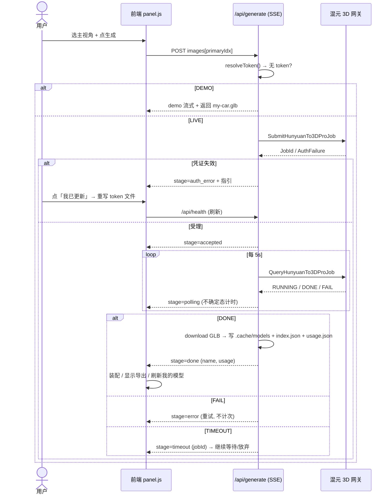

# 增量设计 · 真实图生 3D 全链路（hunyuan3d-live）

> 本文档由**主理人齐活林（Qi）临时接管**产出。原因：架构师子 agent 在 2026-08-29 21:06 触发平台调用频率限制（HTTP 429，重置时间 2026-08-30 14:50 UTC+8），为避免阻塞推进，主理人直接落盘设计。待 agent 配额恢复后，仍建议由架构师做一次复核。
>
> 关联文档：`docs/increment-PRD-hunyuan3d-live.md`（许清楚 · 产品经理，669 行）。本设计对齐该 PRD。

---

## 0. 已核实技术事实（设计依据）

| # | 事实 | 来源 |
|---|------|------|
| F1 | `resolveToken()` 在 `server/index.mjs:128`（`handleGenerate`）与 `:274`（`/api/health`）**每次请求都调用**，不是启动时读一次 | 读码核实 |
| F2 | 改 `~/.workbuddy/tokens/hunyuan3d` 文件后**无需重启**服务，下一次请求即生效 | F1 推论 |
| F3 | 凭证返回值带精确过期时间字段 `tempTokenExpiresAt`（ISO8601，如 `2026-08-30T12:47:03Z`） | 实测拿到 |
| F4 | 服务端**无 token 刷新通道**：凭据获取能力绑定在 IDE 会话/助手侧，没有对外的 HTTP 刷新接口 | 实测 + 工具说明 |
| F5 | 混元 3D 无公开取消接口、无余额/配额查询接口 | 接口契约核实 |
| F6 | 现有代码只传单图 base64（`hunyuan3d.mjs:182` `body.ImageBase64 = imagesBase64[0]`），多图其余丢弃 | 读码核实 |
| F7 | 整车 GLB 约 44MB、轮毂约 29MB；单次生成 2~5 分钟 | 实测 |
| F8 | `src/tuning/`（wheelRig/shellCutter/chassis/shellMeasure）与 `src/main.js` 正被另一条任务线（车壳+底盘分离）并行改动 | 会话上下文 |

---

## 1. 实现方案与关键决策

### 1.1 凭证方案

**文件格式（两行，向后兼容）**——`~/.workbuddy/tokens/hunyuan3d`：
```
tk_ScFRKumsER0plIygsSMrGkVa6tDj17mQ
2026-08-30T12:47:03Z
```
- 第一行：tempToken（必填）
- 第二行：过期时间 ISO8601（可选）。存在则 UI 显示**精确**过期；缺失则降级为「文件 mtime + 16h 估算」（软提醒，不拦截生成）
- 兼容旧单行格式（缺第二行不报错）

**`resolveToken()` 改造**：返回 `{ token, expiresAt }`。`expiresAt` 取值优先级：第二行有效 ISO8601 > 文件 mtime + 16h。环境变量 `HUNYUAN3D_TOKEN` 仍优先于文件，且环境变量无法携带过期时间（故走 mtime+16h 估算）。

**状态机**（供前端 P0-2 四态）：
- `LIVE`：token 存在且未到过期（精确或估算均未过）
- `EXPIRING`：距过期 < 2h（黄）
- `INVALID`：token 缺失 / 提交时收到 `auth_error`（红）
- `DEMO`：无 token（灰）

**结论**：不做自动刷新（F4）；只做热更新免重启（F1/F2）+ 精确过期展示（F3）+ 失效引导换票。

### 1.2 错误分类（P0-1 / P0-7 核心）

后端在 `handleGenerate` 的 try/catch 与 `hy3d.queryJob` 轮询中，对网关错误归类：

- **AUTH 类**（→ `stage:'auth_error'`）：`e.code` 命中集合
  `{'AuthFailure','InvalidCredential','TokenExpired','SignatureDoesNotMatch','UnauthorizedOperation','AccessDenied'}`，或 HTTP 401/403
- **REJECT 类**（提交被拒，归为可重试用户错误，不计次）
- **CLOUD_FAIL 类**（云端 FAIL，计次不计消耗）
- **TIMEOUT 类**（轮询超时，保留 JobId 续等）
- **DOWNLOAD 类**（下载失败，自动重试 2 次）

> **红线（实现时不可违反）**：任何失败都**不得**调用 `loadCarFromUrl`/`loadWheel` 去载入 `public/models` 下的 `my-car.glb`/`wheel.glb` 冒充结果。失败只回传 `stage:'error'` 及具体原因。

### 1.3 多图（P0-4）

零后端改动。前端维护「已选主视角索引」`primaryIdx`（默认 0）；提交时 `body.images[primaryIdx]` 作为 `images[0]`（即主视角）传给后端。后端 `multiViewJson` 通道**保持不动**。文案明确「仅使用选中的 1 张」。

### 1.4 失败分级处置映射

| 场景 | stage | 前端行为 | 计消耗次 |
|------|-------|----------|----------|
| 凭证失效 | `auth_error` | 三步修复指引 + 「我已更新」按钮 | 否 |
| 提交被拒 | `error`（reject） | 明确原因 + 「重试」 | 否 |
| 云端 FAIL | `error`（fail） | 「同样参数重试」 | 否 |
| 轮询超时 | `error`（timeout，含 `jobId`） | 「继续等待 8 分钟」/「放弃」 | 否 |
| 下载失败 | 自动重试 2 次（2s/6s）后 `error` | 重试中显示提示 | 成功算 1 |
| 用户取消 | （断开 SSE） | 上传区复位，场景不变 | 否 |
| DEMO 模式 | `demo` | 既有流程 | 否 |

---

## 2. 文件清单（新增 / 修改）

| 文件 | 类型 | 职责 | 涉及 P0 |
|------|------|------|---------|
| `server/index.mjs` | 改 | `resolveToken` 返回 `{token,expiresAt}`；`handleGenerate` 加错误分类 + 失败分级 + 文件名可读化 + 写 `index.json`/`usage.json`；`/api/health` 返回过期信息 | 1/7/8/9/10 |
| `server/hunyuan3d.mjs` | 改 | 新增 `AUTH_CODES` 导出与 `classifyError(e)` 辅助；签名层**不动** | 1 |
| `scripts/token.mjs` | 新增 | `npm run token -- tk_xxx` 写入文件（含第二行过期时间可选）；人类友好 | P1-5 |
| `src/api/generate.js` | 改 | 消费新 stage（`auth_error`/`prepare`/`timeout`/`retry`），透传 `jobId`/`expiresAt` | 1/6/7 |
| `src/ui/panel.js` | 改 | 状态卡四态（P0-2）、首次确认内嵌（P0-3）、主视角点选（P0-4）、拍摄引导折叠（P0-5）、等待态重构（P0-6）、失败分级 UI（P0-7）、导出按钮（P0-8）、我的模型列表（P0-9）、额度计数（P0-10） | 2/3/4/5/6/7/8/9/10 |
| `src/main.js` | 改 | 历史模型「载入」接线（`loadFromUrl` 复用既有 `loadCarFromUrl`/`rig.mountWheel`），**仅新增函数，不动既有装配** | 8/9 |
| `README.md` | 改 | P0-11 文档纠错 | 11 |

> **冲突规避（F8）**：本设计**不修改** `src/tuning/` 下任何文件。对 `src/main.js` 的改动仅以「新增 `loadHistoryFromUrl()` 函数 + 在 P0-9 列表点击时调用」形式出现，与车壳/底盘分离任务的 `refitCar()`/`autoDetectCorners()` 改动区域完全隔离，互不影响。

---

## 3. 数据结构与接口设计

### 3.1 token 文件
两行文本（见 §1.1）。

### 3.2 `.cache/models/index.json`
```json
[
  {
    "name": "car-20260829-2145-a1b2c3.glb",
    "kind": "car",
    "size": 46412345,
    "createdAt": "2026-08-29T21:45:12",
    "imageCount": 1,
    "faceCount": 180000,
    "jobId": "abc-123"
  }
]
```

### 3.3 `.cache/usage.json`
```json
{ "success": 1, "failed": 0, "lastAt": "2026-08-29T21:45:12" }
```
- 仅 `stage:'done' && mode:'live'` → `success += 1`
- 其余失败类型不计 success；失败可选计 `failed`

### 3.4 SSE 事件（扩展）
保留：`demo / submit / accepted / polling / downloading / done / error`
新增/改造：
- `prepare`：确定态（准备照片），`progress:0.02`
- `auth_error`：`detail` 含网关原始错误码，触发三步指引
- `timeout`：`detail.jobId` 携带原 JobId，供「继续等待」续等
- `retry`：下载自动重试提示
- `done.result` 增加 `name`、`createdAt`、`usage`（回传 usage.json 摘要供 UI 刷新）

---

## 4. 程序调用流程（时序图）



---

## 5. 有序任务列表（含依赖 / MVP 标注）

> MVP 底线 = **T1 + T2 + T4 + T7**，做到即可：用户「知道要做什么 → 换票成功 → 传自己照片 → 真的生成 → 失败不困惑」。

| ID | 任务 | 文件 | 依赖 | MVP |
|----|------|------|------|-----|
| T1 | token 文件支持过期时间：`resolveToken()` 返回 `{token,expiresAt}`；新增 `classifyError()` 导出 `AUTH_CODES` | `server/index.mjs` `server/hunyuan3d.mjs` | — | ✅ |
| T2 | `handleGenerate` 错误分类：AUTH→`auth_error`、REJECT/FAIL/TIMEOUT/DOWNLOAD 各自 stage；**禁止**失败降级 DEMO | `server/index.mjs` | T1 | ✅ |
| T3 | `/api/health` 返回 `expiresAt` 与 `mode`；`/api/generate` 的 `done` 回传 `name`/`usage` | `server/index.mjs` | T1 | |
| T4 | 前端消费新 stage：状态卡四态 + `auth_error` 指引 + 「我已更新」刷新 health | `src/ui/panel.js` `src/api/generate.js` | T2,T3 | ✅ |
| T5 | 首次 LIVE 确认内嵌上传区（localStorage 持久化，仅一次） | `src/ui/panel.js` | T4 | |
| T6 | 主视角点选（缩略图 + `primaryIdx`）+ 文案「仅使用选中的 1 张」 | `src/ui/panel.js` | T4 | |
| T7 | 失败分级 UI：超时续等（带 JobId）、下载重试提示、降级 DEMO 按钮文案带「演示」、修「降低面数」文案 | `src/ui/panel.js` | T2 | ✅ |
| T8 | 等待态重构：不确定态进度条 + mm:ss 计时器 + 四段真语义文案 + 取消按钮 + 等待期控件可操作 | `src/ui/panel.js` | T4 | |
| T9 | 拍摄引导折叠块（整车/轮毂两套，不阻断） | `src/ui/panel.js` | T4 | |
| T10 | 文件名可读化 `{kind}-YYYYMMDD-HHmm-hash6.glb` + 写 `index.json` | `server/index.mjs` | T2 | |
| T11 | 「我的模型」列表 + 载入/导出 + 历史持久化 | `src/ui/panel.js` `src/main.js` `server/index.mjs` | T10 | |
| T12 | 额度计数 `usage.json` + 侧栏展示（失败不计次） | `server/index.mjs` `src/ui/panel.js` | T10 | |
| T13 | `npm run token` 脚本（`scripts/token.mjs` + package.json） | 新增 | — | |
| T14 | README 纠错（P0-11） | `README.md` | — | |

---

## 6. 共享知识（跨文件约定）

- **错误码集合**：`server/hunyuan3d.mjs` 导出 `AUTH_CODES = new Set([...])` 与 `classifyError(e)`，全局唯一来源，前端不得自行判断。
- **SSE stage 命名**：见 §3.4，新增 stage 必须小写蛇形；`detail` 字段承载原因，`jobId` 仅出现在 `timeout` 的 `detail` 中。
- **路径常量**：`.cache/models` 与 `.cache/usage.json` 由 `server/index.mjs` 内 `CACHE_DIR` 派生，UI 不直接拼路径。
- **时间格式**：`createdAt` 服务端本地 ISO8601；UI 展示 `MM-DD HH:mm`；过期时间展示 `M/D HH:mm`。
- **红线常量**：`FORBID_DEMO_FALLBACK = true`——任何 `stage:'error'` 分支不得触发演示模型载入。

---

## 7. 待明确事项

1. `tempTokenExpiresAt` 是否为**绝对过期**（到点即失效）还是**签发后 16h**？UI 软提醒以此为准即可，不影响代码。
2. P1-5（`npm run token`）写入第二行过期时间的时机：由助手侧取凭证后一并写入，还是用户手动补？建议助手侧取凭证后直接写两行（含过期），用户零操作。
3. 车壳+底盘分离任务（F8）若先于本任务完成，需确认 `refitCar()` 与新 `loadHistoryFromUrl()` 不冲突——二者操作不同对象（前者 carInner，后者整车 GLB 替换），预计无冲突，待实现时复核。
