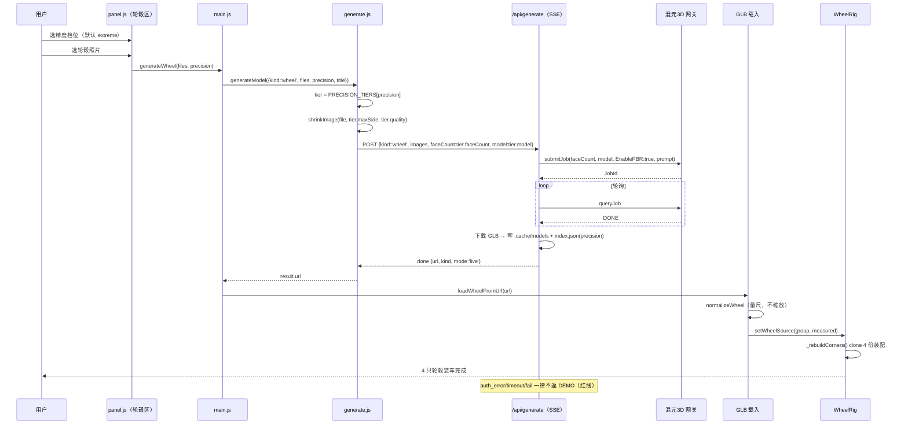
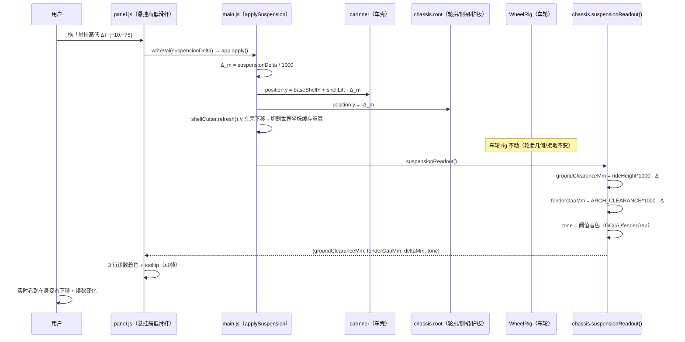
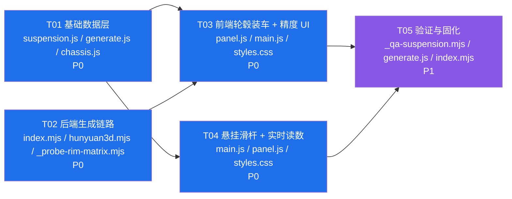

# 增量系统设计 — 混元 3D 轮毂生成（精度拉满）+ 车身悬挂高低调节

| 项 | 内容 |
|---|---|
| 文档类型 | 增量系统设计（配套 `increment-PRD-rim-suspension.md`） |
| 项目 | `garage-vite`（Vite + Three.js 0.160.1 汽车改装 3D 预览） |
| 架构师 | 高见远（Gao） |
| 版本 | v1.0 |
| 状态 | 待评审 → 待工程师实现 |
| 上游 | `increment-PRD-rim-suspension.md`（许清楚 · 产品经理，P0-1/2/3、P1-1/2/3） |
| 硬约束 | 不改 `three@0.160.1`；**不新增任何第三方依赖**；后端生成失败红线「绝不降级返回 DEMO 预置模型」保持；`verify.mjs` 35/35、`_qa-edge-tire.mjs` 101/101 必须继续通过 |

---

## 0. 结论先行（给工程师的三句话）

1. **轮毂生成链已存在**：前端 `generateWheel(files)` → `server/index.mjs` 调混元 3D（`provider=hy-3d`，零账号 `tcproxy` token，GLB + EnablePBR）→ GLB → 前端 `loadWheelFromUrl` → `rig.setWheelSource` 自动 **clone 4 份装车**。本次只须补「精度档位 → faceCount/分辨率/quality」映射，链路不动。
2. **悬挂 = 车身整体相对车轮下移 Δ**：车轮/轮胎几何不变；`carInner`（车壳）与 `chassis.root`（轮拱内衬/侧裙/护板）同步下移 Δ，二者都属「车身」，车轮 rig 不动。读数为 `groundClearance = baseGC − Δ`、`fenderGap = baseFG − Δ`，纯函数计算，挂 `chassis.suspensionReadout()`。
3. **faceCount / 4096 上限禁止推测写死**：精度「极限档」用变量常量集中在 `src/api/generate.js` 的 `PRECISION_TIERS`，上线前必须跑 `scripts/_probe-rim-matrix.mjs` 探顶矩阵实测固化；**探顶通过前上线默认走「高精」档**，避免生成 FAIL。

---

## 1. 实现方案

### 1.1 轮毂生成链路（如何接）

```
前端 wheelUpload 选精度档
   → panel.js 调 app.generateWheel(files, precision)
   → main.js 透传给 generateModel({kind:'wheel', files, precision})
   → src/api/generate.js:
        PRECISION_TIERS[precision] → {faceCount, model, maxSide, quality}
        shrinkImage(file, maxSide, quality)   // 输入分辨率/质量按档位
        POST /api/generate {kind:'wheel', images, faceCount, model, title, prompt}
   → server/index.mjs handleGenerate:
        读 body.faceCount/body.model（已支持）→ hy3d.submitJob
        enablePbr:true（保持）、ResultFormat:'GLB'（保持）
        prompt 维持 'alloy car wheel rim, rim only, no tire'
        index.json 追加 precision 字段
   → 前端收到 done.url → app.loadWheelFromUrl(url)
        → normalizeWheel（量尺，不缩放）→ rig.setWheelSource
        → wheelRig._rebuildCorners() clone 4 份装配（现有逻辑，不动）
```

**关键点**：`kind:'wheel'` 即 PRD 要求的「轮毂意图 `intent='rim'`」——现有 `kind` 字段已承载该语义，无需新增 `intent` 字段，避免破坏既有 `loadWheelFromUrl` / `rig` 装配链路与 P0-2 失败分级 UI。

### 1.2 精度档位映射（标准 / 高精 / 极限）

> ⚠️ **红线**：极限档 `faceCount` 与 `输入分辨率 4096` 的**真上限未知**，必须由工程师 + QA 实测探顶矩阵确认不 FAIL 后再固化，禁止推测写死最高值。下表 extreme 行为**待实测占位值**，探顶通过前上线默认值降级为 `high`。

| 档位 | faceCount（轮） | model | 输入分辨率 maxSide | 输入质量 quality | 现状/备注 |
|---|---|---|---|---|---|
| `standard` 标准 | 150000 | `3.1` | 2048 | 0.90 | 当前默认，安全 |
| `high` 高精 | 225000（150k×1.5） | `3.1` | 2048 | 0.92 | 探顶低风险，上线默认档 |
| `extreme` 极限 | **250000（起点，待实测）** | `3.1` | **4096（待实测）** | 0.95 | 探顶矩阵取「成功率100%且耗时可接受」的最高组合固化；**探顶通过前不启用** |

**探顶矩阵（固化前必跑，`scripts/_probe-rim-matrix.mjs`）**

| faceCount ↓ \ 分辨率 → | 2048 | 4096 |
|---|---|---|
| 200000 | 测（成功率/耗时/FAIL） | 测 |
| 250000 | 测（建议起点） | 测 |
| 300000 | 测 | 测 |
| 350000 | 测 | 测 |

判据：选「100% 成功且单任务耗时 ≤ 可接受上限（建议 ≤8min）且导出 GLB 在 THREE 中无破面」的最高组合作为 extreme 固化值。QA 复核 GLB 可加载、辐条/中心盖几何基本完整。

### 1.3 悬挂模块挂在哪里

| 模块 | 职责 | 改动 |
|---|---|---|
| `src/tuning/suspension.js`（**新**） | 悬挂物理纯函数 `computeSuspensionReadout()`：输入 `rideHeightM / archClearanceM / odMm / deltaMm` → 输出读数 + 三色 tone。可在 Node 单测。 | 新增 |
| `src/tuning/chassis.js` | 新增 `setSuspension(deltaMm)`（设 `root.position.y = -deltaMm`，不重建几何）+ `suspensionReadout()`（调 suspension.js）。 | 改（只读新增，不动 build/cornerSpec/cutPlan） |
| `src/main.js` | `params.suspensionDelta`（mm）；`applySuspension()`：`carInner.position.y = base + shellLift - Δ_m` 且 `chassis.root.position.y = -Δ_m`（车轮 rig 不动）；`updateChassis` 串联；读数接 `panel.updateReadout()`。 | 改 |
| `src/ui/panel.js` | 轮毂上传区加精度档位选择器；FINE_PARAMS 加「悬挂高低 Δ」滑杆；读数区加 3 行着色。 | 改 |
| `src/ui/styles.css` | 精度选择器（复用 chip）+ 悬挂读数三色 `.susp-good/-warn/-danger` + tooltip。 | 改 |

**不新建 `suspension.js` 之外的几何模块**：悬挂只移动既有 group 的 y 偏移，不新增任何 3D 部件（轮拱内衬、侧裙、护板已存在于 chassis，随 `root` 一起下移）。

### 1.4 悬挂降低的几何语义（拍板项③）

```
降低量 Δ>0 表示「车身降低」。
· 车轮 rig（WheelRig.root）：不动。轮胎接地位置、外径 odMm、轮心高 hubY 全部不变。
· 车壳 carInner.position.y  = baseShellY + shellLift − Δ_m      // 车壳下移 Δ
· 底盘 chassis.root.position.y = −Δ_m                            // 轮拱/侧裙/护板随车身整体下移 Δ
→ 车壳与底盘轮拱开口同步下移，二者相对位置不变，仍对齐；
   轮胎几何不动 → 车身相对车轮下移 = 真实低趴姿态。
```

`baseShellY` 是 `refitCar` 记录的归一化挂载基准；`shellLift` 是现有车身升降（Plus Sizing 标定 + 用户微调）。

---

## 2. 文件清单（相对路径）

### 2.1 新增

| 文件 | 职责 | 依赖 | 规模 |
|---|---|---|---|
| `src/tuning/suspension.js` | 悬挂物理纯函数：`computeSuspensionReadout({rideHeightM, archClearanceM, odMm, deltaMm})` → `{groundClearanceMm, fenderGapMm, odMm, exposureRatio, tone}`；阈值常量 `SUSP_THRESHOLD`。可在 Node 单测。 | `three`（仅类型，无几何） | ~70 行 |
| `scripts/_probe-rim-matrix.mjs` | 探顶矩阵：遍历 faceCount×分辨率，调 `/api/generate`（或直连混元），记录成功率/耗时/FAIL，输出建议 extreme 值。 | `server/index.mjs` 接口 | ~120 行 |
| `scripts/_qa-suspension.mjs` | `suspension.js` 纯函数单测：公式边界（Δ=0/±极端、阈值着色切换、tire 尺寸联动）。 | `suspension.js` | ~90 行 |

### 2.2 修改

| 文件 | 修改范围 | 不动的部分 |
|---|---|---|
| `server/index.mjs` | ① 接收 `body.precision` → 映射 `faceCount`/`model`（复用现有 `body.faceCount` 覆盖逻辑）② `index.json` 追加 `precision` 字段 ③ `DEFAULT_FACE_COUNT.wheel` 注释说明标准/高精/极限 ④ `submitJob` 调用维持 `enablePbr:true` | auth/timeout/fail 三态红线、`DEMO` 模式、`/api/health`、多引擎路由、车型识别 |
| `server/hunyuan3d.mjs` | `submitJob` 增加可选 `quality` 透传（`body.Quality`，字段名待实测确认，缺省忽略） | 签名层、STATUS、`classifyError`、`download` |
| `src/api/generate.js` | ① 新增 `PRECISION_TIERS` 常量（单一真值）② `generateModel` 接收 `precision` → 取 `{faceCount, model, maxSide, quality}` → 透传 `faceCount`/`model` 到 body、`shrinkImage` 用 `maxSide`/`quality` | SSE 解析、`GenerateError` 三态、`health()`、`recognize()` |
| `src/tuning/chassis.js` | ① 新增 `setSuspension(deltaMm)`（设 `root.position.y`）② 新增 `suspensionReadout()` 调 `suspension.js` | `derive/build/update/cornerSpec/cutPlan`（几何构建全不动） |
| `src/main.js` | ① `DEFAULTS` 加 `precision:'high'`（探顶前默认，待升 extreme）、`suspensionDelta:0` ② `generateWheel(files, precision)` 透传 ③ `loadWheelFromUrl` 装配 4 份（不动）④ 新增 `applySuspension()` 并在 `updateChassis`/`apply` 串联 ⑤ 读数接 `panel` | 整车装载、`runGenerate` 失败分级、`rotateCar`、`reset`（保留 shellLift 校准） |
| `src/ui/panel.js` | ① 轮毂上传区加精度档位选择器（standard/high/extreme，默认 extreme 带「可能更慢」提示）② FINE_PARAMS 加「悬挂高低 Δ」[−10,+75] step1 ③ 读数区加 3 行着色（离地/轮拱/降低量）+ tooltip | 场景/灯光/视角区、PRESETS、车身升降 shellLift、轮毂参数滑杆 |
| `src/ui/styles.css` | ① 精度选择器复用 `.chip`/`.seg` ② `.susp-good/.susp-warn/.susp-danger` 着色 + `.susp-tip` tooltip | 其余全部 |

### 2.3 依赖顺序与并行性

```
① suspension.js（纯函数，无内部依赖，最底层）
② src/api/generate.js（PRECISION_TIERS，依赖①概念但独立文件）
③ server/index.mjs + server/hunyuan3d.mjs（后端，与前端并列，消费 faceCount）
④ chassis.js（setSuspension/suspensionReadout，依赖①）
⑤ main.js（applySuspension + precision 透传，依赖①②③④）
⑥ panel.js + styles.css（UI，依赖④⑤）
```

---

## 3. 数据结构与接口

### 3.1 生成请求 / 响应 schema（含 intent、precision）

```mermaid
classDiagram
    direction TB

    class GenerateRequest {
        <<data>> 前端 POST /api/generate
        +string kind = "wheel"   /* 轮毂意图（= intent:'rim'） */
        +ImageInput[] images
        +string precision         /* 'standard'|'high'|'extreme' */
        +string title
        +string prompt            /* 默认 alloy car wheel rim, rim only, no tire */
        +number faceCount          /* 由 precision 推导，可显式覆盖 */
        +string model             /* 默认 '3.1' */
    }

    class ImageInput {
        <<data>>
        +string name
        +string dataUrl            /* base64（含 data: 前缀） */
    }

    class PrecisionTier {
        <<data>> src/api/generate.js PRECISION_TIERS
        +number faceCount
        +string model
        +number maxSide            /* 输入分辨率 */
        +number quality            /* 输入 JPEG 质量 */
    }

    class GenerateResult {
        <<data>> SSE done.result
        +string url
        +string kind
        +string mode               /* 'live'|'demo' */
        +string name
        +string title
        +number bytes
    }

    class SuspensionParams {
        <<data>> state/app.params
        +number suspensionDelta     /* mm，Δ>0 降低 */
    }

    class SuspensionReadout {
        <<data>> chassis.suspensionReadout()
        +number groundClearanceMm
        +number fenderGapMm
        +number odMm                 /* 轮胎外径，随轮辋/胎宽/扁平比变化 */
        +number exposureRatio       /* 车身越低越大（可视化提示） */
        +SuspTone tone               /* {gc, fg, delta} 各自三色 */
    }

    class SuspTone {
        <<enum>> 'good'|'warn'|'danger'
    }

    class GenerateApi {
        <<module>> src/api/generate.js
        +PRECISION_TIERS PrecisionTier
        +generateModel(opts) GenerateResult
        -shrinkImage(file, maxSide, quality) string
    }

    class Suspension {
        <<module>> src/tuning/suspension.js
        +computeSuspensionReadout(spec) SuspensionReadout
        +SUSP_THRESHOLD object
    }

    class Chassis {
        -Group root
        +setSuspension(deltaMm) void
        +suspensionReadout() SuspensionReadout
    }

    class WheelRig {
        -Group root
        +setWheelSource(group, measured) void
        -_rebuildCorners() void   /* clone 4 份，不动 */
    }

    GenerateApi ..> PrecisionTier : uses
    GenerateRequest ..> ImageInput : contains
    GenerateRequest ..> PrecisionTier : precision 推导
    chassis.js ..> Chassis : 持有
    Chassis ..> Suspension : suspensionReadout 调用
    Chassis ..> SuspensionReadout : produces
    SuspensionReadout *-- SuspTone : tone
    SuspensionParams ..> SuspensionReadout : Δ + tire 派生
    WheelRig ..> GenerateResult : loadWheelFromUrl 装配
```

**SuspensionReadout 计算（suspension.js 纯函数，单一真值）**

```
computeSuspensionReadout({ rideHeightM, archClearanceM, odMm, deltaMm }):
    groundClearanceMm = rideHeightM * 1000 - deltaMm
    fenderGapMm       = archClearanceM * 1000 - deltaMm     // 轮拱间隙 = ARCH_CLEARANCE 偏移 - Δ
    exposureRatio     = clamp((baseFG + something - deltaMm) / baseFG, 0, 2)  // 仅可视化提示
    tone.gc   =  groundClearanceMm < 100 ? 'danger' : (groundClearanceMm < 120 ? 'warn' : 'good')
    tone.delta = Math.abs(deltaMm) > 50 ? 'danger' : (Math.abs(deltaMm) > 30 ? 'warn' : 'good')
    tone.fg   =  fenderGapMm < 5 ? 'danger' : (fenderGapMm < 10 ? 'warn' : 'good')
    返回 {groundClearanceMm, fenderGapMm, odMm, exposureRatio, tone}
```

> 注：`rideHeightM = chassis.p.rideHeight`（当前 `RATIO.rideHeight * L`，默认 0.125m = 125mm）；`archClearanceM = ARCH_CLEARANCE = 0.045m`（轮拱相对轮胎外半径偏置，见 chassis.js）。改轮辋/胎宽/扁平比时 `odMm` 重算（经 `tireOuterRadius`），读数随之刷新（满足 US-2.3）。

### 3.2 悬挂状态对象挂哪

- **输入**：`app.params.suspensionDelta`（mm）—— 与 `app.params.chassis.shellLiftUser` 并存（拍板项④），二者叠加成车身最终偏移。
- **计算**：`chassis.suspensionReadout()` 读取 `chassis.p.rideHeight`、`ARCH_CLEARANCE`、`app.params.front/rear` 的 `odMm`、`app.params.suspensionDelta`，返回 `SuspensionReadout`。
- **读取**：`panel.updateReadout()` 调用 `app.chassis.suspensionReadout()` 渲染 3 行着色 + tooltip。
- **应用**：`applySuspension()` 用 `Δ_m = suspensionDelta/1000` 设 `carInner` 与 `chassis.root` 的 y 偏移。

---

## 4. 程序调用流程（时序图）

### 4.1 轮毂生成链（P0-1，含精度档位）



### 4.2 悬挂调节（P0-3，真实物理联动）



---

## 5. 待明确事项（架构师拍板）

| # | PRD 待确认 | **拍板结论** | 理由 |
|---|---|---|---|
| ① | faceCount 真上限？ | **走实测探顶矩阵**，禁止推测写死。extreme 值集中在 `PRECISION_TIERS`，探顶通过前上线默认 `high`。 | 历史已把车 180k→220k、轮 120k→150k 调高但未敢更大；写死最高值会导致生成 FAIL，违反「不返 DEMO 但不保证不 FAIL」红线。 |
| ② | 分辨率 2048 是否已是引擎上限？能否 4096？ | **extreme 档尝试 4096，探顶矩阵含 4096 列；若引擎拒收/超时则回退 2048。** | 高分辨率利于辐条细节，但可能被引擎拒绝或显著增时；须实测。 |
| ③ | 悬挂降低几何语义：仅车身降 / 整体降？ | **仅车身相对车轮下移 Δ**：车壳 + 底盘承载件（轮拱内衬/侧裙/护板）整体下移 Δ，车轮/轮胎不变。 | 符合 PRD ⑤「仅调悬挂时车轮/轮胎几何不变」，车身姿态真实下移；`carInner` 与 `chassis.root` 同步 −Δ 保证轮拱开口仍对齐。 |
| ④ | 新悬挂 slider 与现有 `shellLiftUser` 车身升降 slider 关系？ | **并存，语义区分，同组展示，UI 说明叠加**：车身最终偏移 = `shellLift − Δ`。`shellLiftUser` 保留为 Plus Sizing 车高标定 + 用户微调；`suspensionDelta` 为动态姿态。 | 合并会丢失现有校准逻辑且引入歧义；并存最清晰，代价仅是 UI 加一行说明。 |
| ⑤ | 轮拱负值（蹭胎）判定与处置？ | **仅 warn，不禁用提交**（与项目「警告不阻止」原则一致）。fenderGap<5mm 黄/红预警 + tooltip；<0 红「必蹭胎」但仍允许装车。 | 低趴是合法创作选择，工具告知代价即可；与 hunyuan3d-live 设计「失败不阻止」「J↔胎宽超界不阻止」一脉相承。 |

---

## 6. 所需依赖包

```
（无新增 —— three@^0.160.1 已包含全部所需图元与 GLTFLoader；Node 内置模块足够后端）
- three@^0.160.1: Group / Mesh / BoxGeometry / CylinderGeometry（现有，版本不变）
- 后端纯 Node 内置（http/fs/crypto），无新 npm 依赖
- 探顶脚本复用现有 /api/generate 接口，不引入新库
```

---

## 7. 共享知识 / 约定

```
【坐标系】+X 车头、+Y 上、+Z 车身左侧；车轮轴向 = Z；场景单位 = 米（沿用既有）。
【车身偏移合成】carInner.position.y = baseShellY + shellLift − Δ_m；
                chassis.root.position.y = −Δ_m；
                车轮 rig（WheelRig.root）不动；shellLift = 现有车身升降（含 Plus Sizing 标定）。
【悬挂物理真值】src/tuning/suspension.js 的 computeSuspensionReadout 是唯一公式来源；
                chassis.suspensionReadout() 是前端唯一读取入口，面板不得自行算。
【精度档位真值】src/api/generate.js 的 PRECISION_TIERS 是唯一真值；
                后端仅消费 faceCount/model（body.faceCount 已支持），分辨率/质量前端本地用。
【EXTREME 占位】PRECISION_TIERS.extreme = {faceCount:250000, maxSide:4096, quality:0.95}
                —— 均为待实测占位，探顶矩阵通过前上线默认 'high'；禁止写死更高值。
【轮毂 prompt】默认 'alloy car wheel rim, rim only, no tire'，强调仅轮辋、不含轮胎。
【红线·不降级】后端任意失败（auth/timeout/fail）→ stage 三态，绝不返回 DEMO 预置模型冒充结果。
【阈值着色】GC<100 红 / 100–120 黄 / ≥120 绿；|Δ|>50 红 / 30–50 黄 / ≤30 绿；
            fenderGap<5 红 / 5–10 黄 / ≥10 绿；<0 红「必蹭胎」（仅 warn 不禁用）。
【轮拱负值】仅预警不阻断装车（与「警告不阻止」原则一致）。
【缓存契约】仅调悬挂 Δ 时 carInner 下移 → 必须 shellCutter.refresh() 重算切割世界坐标缓存
            （沿用 applyShellMount 的 refresh 机制，不重建几何）。
【车轮几何不变】wheelRig 在仅调悬挂时完全不重建（rig 不动），保证 ≤1 帧刷新。
```

---

## 8. 风险

| # | 风险 | 级别 | 缓解 |
|---|---|---|---|
| R1 | **faceCount 上限未知**：extreme 档若直接写 250k/300k 可能触发生成 FAIL | 🔴 | 探顶矩阵实测固化；上线默认 `high`；FAIL 走现有重试 UI，不返 DEMO |
| R2 | **4096 是否被引擎拒绝 / 显著超时** | 🔴 | 探顶矩阵含 4096 列；拒绝则 extreme 回退 2048，仅 faceCount 拉满 |
| R3 | **混元 3D 对圆形轮辋几何还原度**（辐条对称、中心盖、螺栓孔） | 🟡 | prompt 强调 'rim only, no tire, symmetrical spokes, center cap, lug bolts'；轮辋直径/J 值滑杆仍可在装车后校正宽度；多视角（P2）可提升对称度 |
| R4 | 悬挂下移导致底盘最低点（地板）穿地 | 🟢 | 最大 Δ=75mm，地板底 worldY = 0.125−0.075 = 0.05m > 0，不穿地 |
| R5 | 车身下移后 shellCutter 切割缓存未刷新 → 轮拱错位 | 🟢 | applySuspension 调用 shellCutter.refresh()（沿用 applyShellMount 机制） |
| R6 | 悬挂与 shellLift 叠加歧义 | 🟢 | UI 同组展示并加一行「车身最终升降 = 车身升降 − 悬挂降低」说明 |

---

## 9. 任务分解（有序，含依赖，给工程师直接落地）

> 共 5 个任务，全部 ≤5 且每组 ≥3 文件。T01/T02 为基础层可并行；T05 固化依赖探顶实测结果。
> 红线：faceCount 不写死最高值；后端任何失败不返 DEMO；不改 three 版本、不新增依赖。

### T01 — 基础数据层：精度档位映射 + 悬挂物理纯函数

| 项 | 内容 |
|---|---|
| **优先级** | **P0** |
| **依赖** | 无 |
| **目标文件** | 新增 `src/tuning/suspension.js`<br>改 `src/api/generate.js`（加 `PRECISION_TIERS` + `generateModel` 接收 `precision` + `shrinkImage(maxSide, quality)` + 透传 `faceCount`/`model`）<br>改 `src/tuning/chassis.js`（加 `setSuspension(deltaMm)` + `suspensionReadout()`，不动几何构建） |

**职责**
- ① `suspension.js`：`computeSuspensionReadout({rideHeightM, archClearanceM, odMm, deltaMm})` 返回 `{groundClearanceMm, fenderGapMm, odMm, exposureRatio, tone}`；`SUSP_THRESHOLD` 阈值常量（GC 100/120、|Δ| 30/50、fenderGap 5/10）。纯函数，无几何依赖。
- ② `generate.js`：`PRECISION_TIERS = {standard:{faceCount:150000,model:'3.1',maxSide:2048,quality:0.90}, high:{faceCount:225000,model:'3.1',maxSide:2048,quality:0.92}, extreme:{faceCount:250000,model:'3.1',maxSide:4096,quality:0.95}}`（extreme 为待实测占位）；`generateModel` 新参 `precision`，取 tier 后 `shrinkImage(file, tier.maxSide, tier.quality)` 且 body 带 `faceCount`/`model`。
- ③ `chassis.js`：`setSuspension(deltaMm)` 设 `this.root.position.y = -deltaMm`（不重建）；`suspensionReadout()` 读 `this.p.rideHeight`、`ARCH_CLEARANCE`、`app` 传入 `odMm` 与 `deltaMm` 调 `suspension.js`。

**验收标准**
- [ ] `suspension.js`：`computeSuspensionReadout({rideHeightM:0.125, archClearanceM:0.045, odMm:661, deltaMm:0})` → `groundClearanceMm=125, fenderGapMm=45, tone 全 good`。
- [ ] `deltaMm=30` → `gc=95(danger), fg=15(good), |Δ|=30(good)`；`deltaMm=60` → `gc=65(danger), fg=-15(danger), |Δ|=60(danger)`。
- [ ] `generate.js`：`PRECISION_TIERS.extreme.faceCount===250000`、`maxSide===4096`；`generateModel({precision:'high'})` 发出的 body 含 `faceCount:225000`、`model:'3.1'`。
- [ ] `chassis.setSuspension(75)` → `root.position.y === -0.075`；`suspensionReadout()` 返回的 `tone` 与纯函数一致。

### T02 — 后端生成链路：轮毂意图 + 精度档位 + 探顶脚本

| 项 | 内容 |
|---|---|
| **优先级** | **P0** |
| **依赖** | 无（与 T01 并列，消费 faceCount 概念） |
| **目标文件** | 改 `server/index.mjs`<br>改 `server/hunyuan3d.mjs`<br>新增 `scripts/_probe-rim-matrix.mjs` |

**职责**
- ① `index.mjs`：`handleGenerate` 读 `body.precision` → 映射 `faceCount`/`model`（复用现有 `body.faceCount` 覆盖；未传 precision 时 `DEFAULT_FACE_COUNT[kind]` 维持）。`appendIndex` 记录 `precision`。`DEFAULT_FACE_COUNT` 注释说明标准/高精/极限档。
- ② `hunyuan3d.mjs`：`submitJob` 新增可选 `quality` 透传（`body.Quality`，字段名待实测确认，缺省忽略）。
- ③ `_probe-rim-matrix.mjs`：遍历 faceCount{200k,250k,300k,350k} × 分辨率{2048,4096}，对真实轮毂图提交，记录成功率/耗时/FAIL，输出建议 extreme 组合。

**验收标准**
- [ ] `POST /api/generate {kind:'wheel', precision:'high'}` → 提交 `FaceCount=225000`。
- [ ] `index.json` 新记录含 `precision` 字段。
- [ ] 红线不变：构造 `auth_error`/`timeout`/`fail` → 不返回 DEMO 预置模型 URL（沿用现有三态）。
- [ ] `_probe-rim-matrix.mjs` 可独立跑，输出探顶矩阵表（成功率/耗时/FAIL）。

### T03 — 前端轮毂装车 + 精度档位 UI

| 项 | 内容 |
|---|---|
| **优先级** | **P0** |
| **依赖** | T01（generate.js 的 PRECISION_TIERS）、T02（后端 faceCount 映射） |
| **目标文件** | 改 `src/ui/panel.js`<br>改 `src/main.js`<br>改 `src/ui/styles.css` |

**职责**
- ① `panel.js`：轮毂上传区（`wheelUpload.zone`）加精度档位选择器（standard/high/extreme 三按钮），默认 extreme 且旁注「最高细节，可能更慢；偶发失败可重试」。
- ② `main.js`：`DEFAULTS` 加 `precision:'high'`（探顶前默认，待升 extreme）；`generateWheel(files, precision)` 透传；`loadWheelFromUrl` 装配 4 份逻辑不动。
- ③ `styles.css`：精度选择器复用现有 `.chip`/`.seg` 样式。

**验收标准**
- [ ] 轮毂上传区显示「标准/高精/极限」三选项，默认「极限」并带提示小字。
- [ ] 选「高精」生成 → Network body 含 `faceCount:225000`。
- [ ] 生成成功 → 4 只轮毂自动装车（沿用 `rig.setWheelSource` clone 4 份），不崩。

### T04 — 悬挂滑杆 + 实时读数（真实物理联动）

| 项 | 内容 |
|---|---|
| **优先级** | **P0** |
| **依赖** | T01（suspension.js 纯函数） |
| **目标文件** | 改 `src/main.js`<br>改 `src/ui/panel.js`<br>改 `src/ui/styles.css` |

**职责**
- ① `main.js`：`DEFAULTS` 加 `suspensionDelta:0`；新增 `applySuspension()`：`carInner.position.y = base + shellLift - Δ_m` 且 `chassis.root.position.y = -Δ_m`，并 `shellCutter.refresh()`；`updateChassis`/`apply` 串联；`panel.updateReadout()` 接 `chassis.suspensionReadout()`。
- ② `panel.js`：FINE_PARAMS 加「悬挂高低 Δ」滑杆（min −10, max 75, step 1, 默认 0，标签「降低量 Δ」）；读数区加 3 行（离地间隙 / 轮拱间隙 / 降低量 Δ）着色 + tooltip。与 `shellLiftUser` 同组并加一行「车身最终升降 = 车身升降 − 悬挂降低」说明。
- ③ `styles.css`：`.susp-good/.susp-warn/.susp-danger` 三色 + `.susp-tip` tooltip（绿=安全/黄=临界/红=危险）。

**验收标准**
- [ ] 拖 Δ 从 0→50：离地 125→75（红）、轮拱 45→−5（红）、降低量 50（红）；3 读数 ≤1 帧刷新。
- [ ] 仅调悬挂时车轮 rig 不动（轮胎几何/接地不变）；车身（车壳+轮拱内衬）整体下移 Δ 可见。
- [ ] Δ=−10（升）时读数均为 good，无红黄。
- [ ] 改轮辋直径/胎宽/扁平比 → `odMm` 重算，悬挂读数随之刷新（US-2.3）。
- [ ] 轮拱间隙 <5mm 仅 warn/红 + tooltip「必蹭胎」，不禁用装车（拍板项⑤）。

### T05 — 验证与固化（探顶定值时回填 extreme）

| 项 | 内容 |
|---|---|
| **优先级** | **P1** |
| **依赖** | T01–T04 |
| **目标文件** | 新增 `scripts/_qa-suspension.mjs`<br>改 `src/api/generate.js`（固化 extreme 值）<br>改 `server/index.mjs`（固化 extreme 值） |

**职责**
- ① `_qa-suspension.mjs`：`suspension.js` 纯函数单测（公式边界、阈值着色切换、tire 尺寸联动）。
- ② 运行 `scripts/_probe-rim-matrix.mjs`，按「成功率100% + 耗时可接受 + 导出无破面」的最高组合，将 `extreme.faceCount`/`maxSide` 回填到 `generate.js` 与 `server/index.mjs`；并将 `main.js` 默认 `precision` 由 `high` 升 `extreme`。
- ③ 回归：`npm run verify` 35/35、`_qa-edge-tire.mjs` 101/101 不破。

**验收标准**
- [ ] `_qa-suspension.mjs` 全断言通过。
- [ ] 探顶矩阵结论落盘（docs 或脚本输出），extreme 值有据可查。
- [ ] 固化后 `PRECISION_TIERS.extreme` 不再为「拍脑袋值」，且有探顶记录支撑。
- [ ] `verify.mjs` 35/35、`_qa-edge-tire.mjs` 101/101 通过（一行不改旧用例）。

### 9.1 任务依赖图



**并行建议**：T01 与 T02 可同时开工（后端消费 faceCount、前端定义 PRECISION_TIERS，概念一致但文件独立）。T03/T04 在 T01 就绪后并行实现（二者都改 panel/main/styles，可由同一人顺序或交错完成）。T05 等探顶实测后固化。
