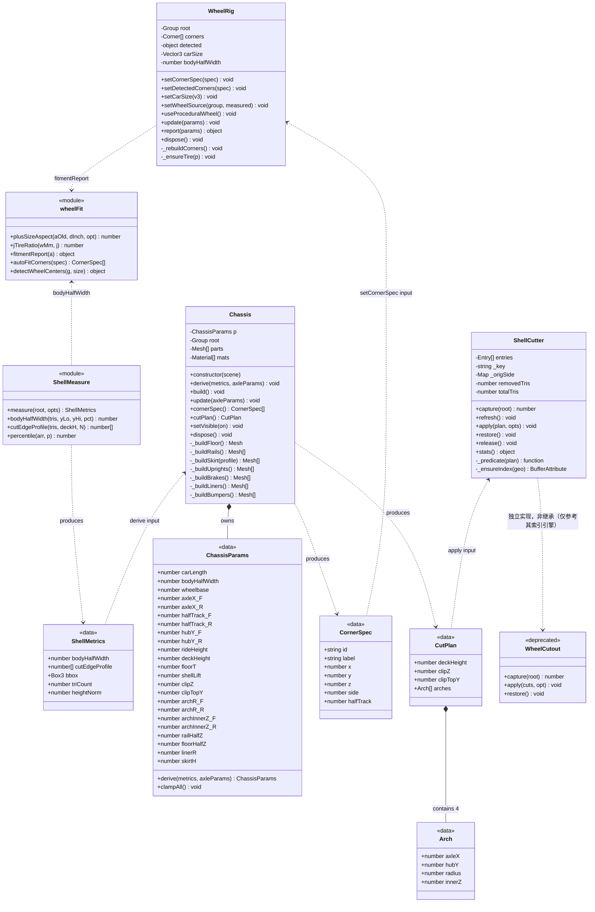
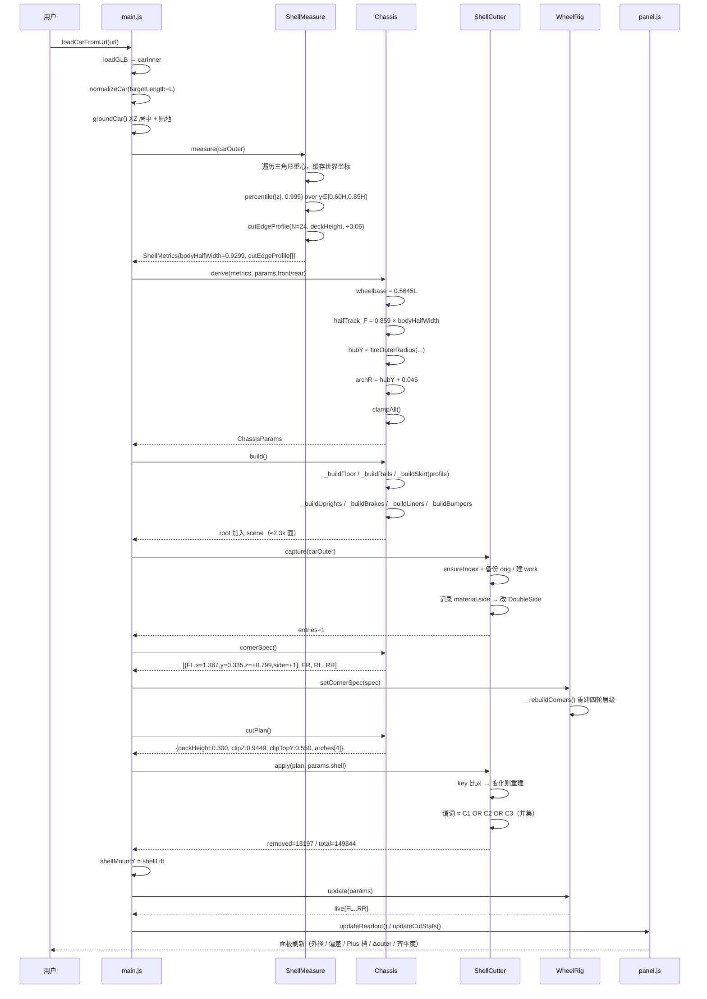
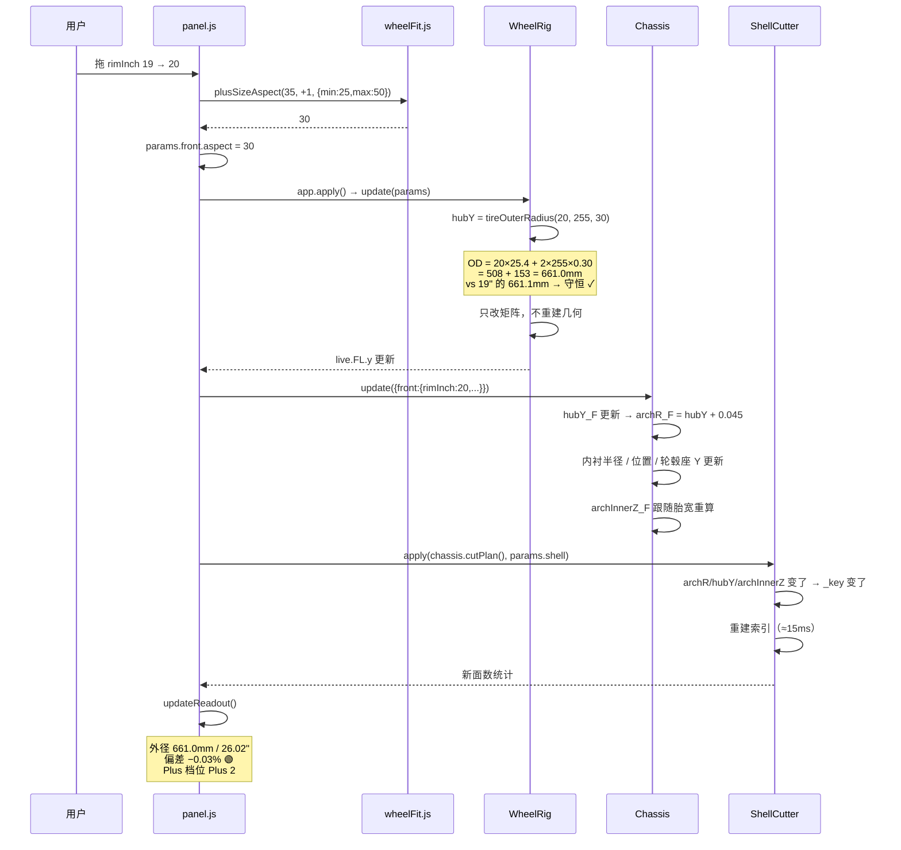
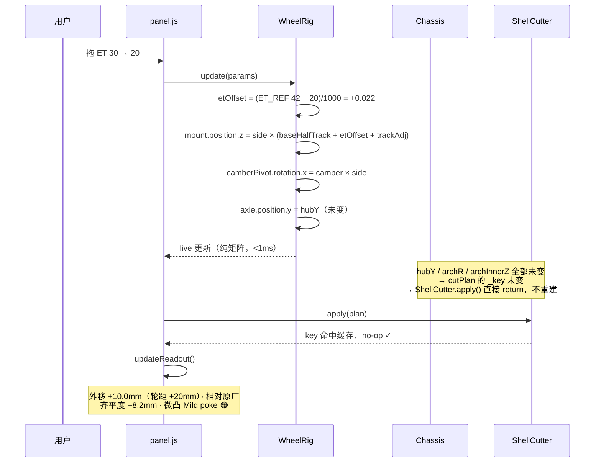
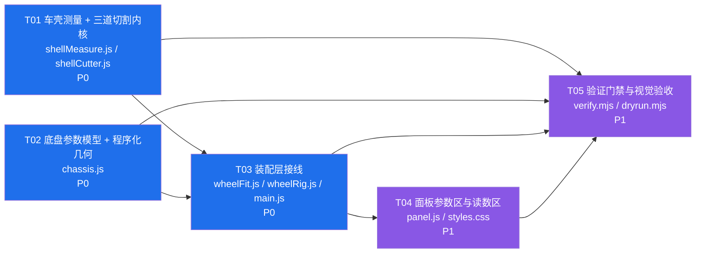

# 增量系统设计 — 车壳（Shell）/ 底盘（Chassis）分层架构

| 项 | 内容 |
|---|---|
| 文档类型 | 增量系统设计（配套 `increment-PRD-fitment.md`） |
| 项目 | `garage-vite`（Vite + Three.js 0.160.1 汽车改装 3D 预览） |
| 架构师 | 高见远（Gao） |
| 版本 | v1.0 |
| 状态 | 待评审 → 待工程师实现 |
| 上游 | `docs/increment-PRD-fitment.md`（974 行 / 62 条来源） |
| 硬约束 | 不改 `src/` 任何代码；不新增依赖；`three@0.160.1` 不变；`verify.mjs` 35/35、`_qa-edge-tire.mjs` 101/101 必须继续通过 |

---

## 0. 结论先行

### 0.1 被证伪的方向（彻底放弃）

「探测车轮位置 → 圆柱切除 → 换新轮」这条路的失败不是参数调得不好，而是**前提不成立**：实测 `public/models/my-car.glb` 里**根本没有车轮几何体**。

我在写本设计前独立复测了一遍（数据见 §1），与你给的结论完全一致，并补充了三条新证据。

### 0.2 新架构一句话

> **车轮不再从车壳里「挖」出来，而是本来就长在底盘上。**
> 车壳退化为一个贴图外壳，底盘成为车轮、轮距、轴距、轮心高的**唯一几何真值来源**。
> 换轮子 = 换底盘上的 mesh，与车壳彻底解耦。

### 0.3 三句话给工程师

1. **Chassis（新）** 是参数化程序化模型，输出四个 `{x, y, z, side}`，这是全系统唯一的轮位真值。
2. **ShellCutter（新）** 对车壳做**三道纯几何切割**（底切 / 侧切 / 轮拱开口），只依赖 Chassis 的 `axleX` 与 `halfTrack`，**完全不依赖任何车轮探测**。
3. **WheelRig（改）** 不再自己算轮位，改为接收 Chassis 的轮位；`ET_REF = 42` **保持不变**（测试锁死）。

---

## 1. 实测复现：车壳里到底有什么

> 全部数据由我在本机重跑得到（归一化到 `carLength = 4.600m`），可复现。

### 1.1 模型基本事实

| 项 | 实测值 |
|---|---|
| 文件 | `public/models/my-car.glb`，44.7 MB |
| mesh 数 / 材质数 / primitive 数 | **1 / 1 / 1** |
| 三角面数 | **149,844** |
| 是否有索引 | 有 |
| 归一化后包围盒 (L×H×W) | **4.600 × 1.360 × 2.089** |

### 1.2 按 y 分层的面数与宽度剖面

| y 区间 (m) | 面数 | 该层 max\|z\| | 判读 |
|---|---:|---:|---|
| 0.00 – 0.10 | 4,443 | 0.642 | 腹部（楔形底部） |
| 0.10 – 0.20 | 3,353 | 0.702 | 腹部 |
| 0.20 – 0.30 | 2,782 | 0.753 | 腹部 |
| 0.30 – 0.35 | 3,080 | 0.969 | 腹部上缘，伪影开始 |
| 0.35 – 0.40 | 6,236 | **1.040** | ← 最宽处出现 |
| 0.40 – 0.50 | 11,126 | **1.045** | ← 最宽处 |
| 0.50 – 0.60 | 7,196 | 0.930 | 车身侧板（稳定） |
| 0.60 – 0.70 | 10,619 | 0.935 | 车身侧板 |
| 0.70 – 0.90 | 29,004 | 0.932 | 车身侧板 |
| 0.90 – 1.40 | 72,005 | 0.923 | 车顶 / 上部 |

**与你的数据完全吻合**：y < 0.35 面数极低，从 y=0.35 起单调上升 —— 那是普通车身侧板，不是车轮。

### 1.3 三条新证据

**证据 A — 现有探测器的输出在几何上不可能成立。**

```
scripts/probe-wheels.mjs 实测输出：
  前轴 x=1.176  y=0.571  z=±0.693   估算轮半径 = 0.726m
  后轴 x=-1.229 y=0.471  z=±0.731   估算轮半径 = 0.721m
```

「轮半径 0.72m」= **轮径 1.45m**，而整车高只有 1.36m。一个比车还高的轮子不存在。
真实 R230 轮胎 OD 661mm，缩放到 4.6m 车长只有 **0.671m** —— 探测值大了 **2.16 倍**。
→ 探测器抓到的是**整个下半侧板的质心**，y 被车身拉高 1.6 倍。

**证据 B — 最宽处不在轮拱上，而在车的纵向中央。**

```
max|z| 网格（单位 cm；行 = y，列 = x；仅取 y ≤ 0.80）

 y\x   -2.3 -2.1 -1.9 -1.7 -1.5 -1.3 -1.1 -0.9 -0.7 -0.5 -0.3 -0.1  0.1  0.3  0.5  0.7  0.9  1.1  1.3  1.5  1.7  1.9
 0.75   69   83   87   91   91   91   92   91   89   90   90   90   91   90   90   92   92   91   91   90   88   81
 0.70   68   82   86   90   91   91   93   90   89   90   90   91   91   91   92   92   92   91   91   90   86   80
 0.65   60   80   84   89   92   89   93   90   90   90   91   91   91   91   92   90   91   89   91   85   77
 0.60   43   79   83   88   93   93   93   89   90   90   90   91   91   91   90   90   91   92   90   82   74
 0.55   37   79   83   86   91   92   91   89   91   90   90   90   90   90   89   88   90   90   85   79   60
 0.50   32   79   82   85   88   89   89   89   93   91   90   90   89   89   88   87   86   86   85   80   76
 0.45   29   78   81   83   86   88   88   88   88   88   88   88  102  100   85   84   83   81   79   74   24
 0.40    4   75   79   82   84   86   87   87   86   86   84   84  103  102   82   81   79   77   39    .    .
 0.35   19   69   73   77   80   82   82   82   82   81   80   78  103  101   79   72   52    .    .    .    .
 0.30   29   37   63   69   73   75   77   74   75   75   76   76   76   91   75    .    .    .    .    .    .
 0.25    .    .    .   11   62   71   73   72   73   73   73   74   74   75   24    .    .    .    .    .    .
 0.20    .    .    .    .   42   67   71   69   70   70   71   71   73   71    .    .    .    .    .    .    .
 0.15    .    .    .    .    .   62   68   68   67   68   68   69   70   13    .    .    .    .    .    .    .
 0.10    .    .    .    .    .   27   63   66   65   65   65   67   65    .    .    .    .    .    .    .    .
 0.05    .    .    .    .    .    .   44   62   64   64   64   63    .    .    .    .    .    .    .    .    .
 0.00    .    .    .    .    .    .    .   48   59   60   59   38    .    .    .    .    .    .    .    .
```

|z| = 1.02~1.03 的凸起出现在 **x ∈ [0.0, 0.45]、y ∈ [0.35, 0.50]** —— 车的**纵向中央底部**，不是四个轮拱。
这是重建伪影（疑似排气 / 地面阴影区）。**它会导致「底切 + 轮拱开口」两道切割治不好，必须加第三刀。**

**证据 C — 车壳前部（x > 0.8）在 y < 0.38 完全没有任何几何体。**

```
y ∈ [0.30, 0.36] 分 x 切片的 max|z| 与面数：
  x[-2.30,-1.92)  max|z|=0.615   faces=878
  x[-1.92,-1.53)  max|z|=0.722   faces=1017
  x[-1.53,-1.15)  max|z|=0.762   faces=639
  x[-1.15,-0.77)  max|z|=0.783   faces=352
  x[-0.77,-0.38)  max|z|=0.763   faces=139
  x[-0.38, 0.00)  max|z|=0.765   faces=42
  x[ 0.00, 0.38)  max|z|=1.008   faces=614   ← 伪影
  x[ 0.38, 0.77)  max|z|=0.777   faces=383
  x[ 0.77, 1.15)  max|z|=  —     faces=0     ← 空
  x[ 1.15, 1.53)  max|z|=  —     faces=0     ← 空
  x[ 1.53, 1.92)  max|z|=  —     faces=0     ← 空
  x[ 1.92, 2.30)  max|z|=  —     faces=0     ← 空
```

**这意味着底盘必须自带前保险杠横梁 / 前下护板**，否则从正前 45° 低机位看会直接穿透看到地面。

### 1.4 关键量化发现：车壳的真实车身宽度

车壳包围盒宽度 2.089m **不是车身宽度**，它被中央底部伪影撑大了。

```
在 y ∈ [0.60, 0.85] 测量带内统计 |z|：
  p50   = 0.7538（含内饰 / 内侧面，被稀释）
  p90   = 0.9056
  p98   = 0.9201
  p99.5 = 0.9299   ← 采用
  p99.9 = 0.9339
  max   = 0.9355
```

**车身半宽 = 0.930m（车身宽 1.860m）。**

对照：真实 R230 车宽 1815mm，缩放到 4.6m 车长 = **1.841m（半宽 0.920m）**，**误差仅 +1.1%**。

→ **车身侧板的位置是可信的，只有包围盒不可信。**
→ **任何依赖 `carSize.z / 2` 的计算（现有 `wheelRig.js:331` 的 `bodyHalfWidth`）当前偏大 114mm，必须换成测量带宽。** 这是齐平度读数一直不准的隐藏根因之一，PRD 冲突清单里没列，属新增冲突项。

---

## 2. 分层架构

### 2.1 三层职责边界

```
┌──────────────────────────────────────────────────────────────┐
│ Shell（车壳）  — 用户上传照片 → 混元 3D → GLB                │
│  · 唯一职责：提供「车身外观」的贴图与轮廓                     │
│  · 不含任何车轮语义，不含任何运动学真值                       │
│  · 被动接受切割，被动接受挂载变换                             │
│  · 生命周期：loadGLB → normalize → measure → cut → mount     │
└──────────────────────────────────────────────────────────────┘
                    ↓ 提供 bodyHalfWidth / cutEdgeProfile
┌──────────────────────────────────────────────────────────────┐
│ Chassis（底盘）  — 程序化参数化生成，全系统唯一真值来源       │
│  · 拥有：轴距 / 轴心 X / 前后轮距 / 轮心高 / 离地间隙         │
│  · 提供：四轮几何 + 轮毂座 + 悬挂 + 地板 + 内衬 + 前后护板    │
│  · 输出 cornerSpec() → CornerSpec[]   给 WheelRig            │
│  · 输出 cutPlan()    → CutPlan        给 ShellCutter         │
│  · 生命周期：derive(metrics) → build() → update(axleParams)  │
└──────────────────────────────────────────────────────────────┘
                    ↓ cornerSpec()
┌──────────────────────────────────────────────────────────────┐
│ WheelRig（车轮装配）— 已有模块，收敛为纯消费者                │
│  · 不再自己算轮位，只消费 chassis.cornerSpec()                │
│  · 仍然负责：ET 平移 / J 缩放 / 倾角旋转 / 轮胎几何重建       │
│  · 仍然负责：fitment 报告（改用测量带宽 + OE_ET）             │
└──────────────────────────────────────────────────────────────┘
```

### 2.2 依赖方向（严格单向，无环）

```
main.js
  ├─→ ShellMeasure   ──(ShellMetrics)──→ Chassis.derive()
  ├─→ Chassis
  │      ├─(CornerSpec)──→ WheelRig.setCornerSpec()
  │      └─(CutPlan)─────→ ShellCutter.apply()
  ├─→ ShellCutter    ──(接管 carOuter 索引)
  └─→ panel.js       ──(读写 params)──→ 以上全部
```

**禁止反向依赖**：`chassis.js` 不 import `wheelRig.js`；`shellCutter.js` 不 import `chassis.js`（只接收纯数据 plan）。
三个新模块都可在 Node 里独立单测，与现有 `verify.mjs` 的做法一致（不需要 WebGL）。

### 2.3 生命周期与失效域

| 事件 | Shell | Chassis | WheelRig | ShellCutter |
|---|---|---|---|---|
| 换车（新 GLB） | 重建 | `derive()` 重算 | `_rebuildCorners()` | `release()` + `capture()` |
| 改车长 | 重归一 + 重测 | `derive()` 重算 | `setCarSize()` | `refresh()` |
| 转 90° | 重归一 + 重测 | `derive()` 重算 | `setCarSize()` | `refresh()` |
| 改 ET / J / 倾角 | 不动 | 不动 | `update()`（纯矩阵） | **不重建** |
| 改轮辋直径 / 胎宽 / 扁平比 | 不动 | `hubY`、`archR` 变 | `update()` + 轮胎重建 | **重建** |
| 改底盘参数（轴距/轮距/离地/甲板高） | 不动 | `build()` 重建 | `setCornerSpec()` | **重建** |
| 改车壳切割参数 | 不动 | 不动 | 不动 | **重建** |

**性能**：`apply()` 全量重建 149,844 面约 10–20ms。只有上表标注「重建」的三类操作才触发，ET/J/倾角拖动不触发 —— 这个性质必须保住，沿用现有 `_key` 缓存机制（按 plan 序列化字符串比对）。

---

## 3. 底盘参数模型（核心）

### 3.1 参数表

单位：场景单位 = 米（车长归一到 `carLength`，默认 4.600）。
`k = carLength / 4.535`（R230 真车长 4535mm 的缩放系数，默认 k = 1.01433）。

#### A. 主参数（面板可调，均带自动推导初值）

| # | 参数 | 符号 | 默认值 | 推导公式 | 依据 |
|---|---|---|---|---|---|
| A1 | 车长 | `L` | 4.600 | 用户输入（归一目标） | — |
| A2 | 轴距 | `wheelbase` | **2.597** | `0.5645 × L` | R230 2560/4535 = 0.5645 |
| A3 | 前轴 X | `axleX_F` | **+1.367** | `L/2 − 0.2029 × L` | 前悬/车长 ⚠️建议值，见 §9-R3 |
| A4 | 后轴 X | `axleX_R` | **−1.230** | `−(L/2 − 0.2326 × L)` | 后悬/车长 ⚠️建议值 |
| A5 | 前轮距半 | `halfTrack_F` | **0.7988** | `0.859 × bodyHalfWidth` | R230 779.5/907.5 = 0.8590 |
| A6 | 后轮距半 | `halfTrack_R` | **0.7923** | `0.852 × bodyHalfWidth` | R230 773.5/907.5 = 0.8523 |
| A7 | 轮心高（前） | `hubY_F` | **0.3353** | `tireOuterRadius(front)` | 轮心 = 轮胎外半径（接地） |
| A8 | 轮心高（后） | `hubY_R` | **0.3315** | `tireOuterRadius(rear)` | 同上 |
| A9 | 离地间隙 | `rideHeight` | **0.125** | `0.0272 × L` | R230 空载约 120mm |
| A10 | 地板厚 | `floorT` | 0.035 | 固定 | — |
| A11 | 车壳甲板高（= 底切高） | `deckHeight` | **0.300** | `0.0652 × L` | 见 §4.2 |
| A12 | 车身升降 | `shellLift` | 0.000 | `clamp(R_avg − R_OE_avg, ±0.06)` + 用户偏置 | 见 §5.2 |

#### B. 派生参数（只读）

| # | 参数 | 符号 | 默认值 | 公式 |
|---|---|---|---|---|
| B1 | 车身半宽（测量） | `bodyHalfWidth` | **0.9299** | `percentile(\|z\|, 0.995)` over y∈[0.60H, 0.85H] |
| B2 | 轮拱半径（前） | `archR_F` | **0.380** | `hubY_F + 0.045` |
| B3 | 轮拱半径（后） | `archR_R` | **0.376** | `hubY_R + 0.045` |
| B4 | 轮拱内边界（前） | `archInnerZ_F` | **0.6495** | `halfTrack_F − tireW_F/2 − 0.02` |
| B5 | 轮拱内边界（后） | `archInnerZ_R` | **0.6278** | `halfTrack_R − tireW_R/2 − 0.02` |
| B6 | 侧向裁剪阈值 | `clipZ` | **0.9449** | `bodyHalfWidth + 0.015` |
| B7 | 纵梁半宽 | `railHalfZ` | 0.6956 | `halfTrack_avg − 0.10` |
| B8 | 地板半宽 | `floorHalfZ` | 0.6356 | `halfTrack_avg − 0.16` |
| B9 | 内衬半径 | `linerR` | 0.375 | `archR − 0.005` |
| B10 | 内衬外端 Z | `linerOuterZ` | 0.9449 | `bodyHalfWidth + 0.015` |
| B11 | 内衬内端 Z | `linerInnerZ` | 0.6345 | `archInnerZ + 0.005` |
| B12 | 裙板高度 | `skirtH` | 0.195 | `deckHeight − rideHeight + 0.02` |

#### C. 面板「底盘 / 车壳」区可调项

| 参数 | 范围 | 步进 | 默认 | 说明 |
|---|---|---|---|---|
| 轴距 | 2.2 – 3.2 m | 0.01 | 2.597 | 覆盖轿车到长轴 |
| 前轴位置偏移 | −0.40 – +0.40 m | 0.005 | 0 | 相对 A3 推导值 |
| 后轴位置偏移 | −0.40 – +0.40 m | 0.005 | 0 | 相对 A4 推导值 |
| 前轮距 | 1.30 – 1.90 m | 0.005 | 1.598 | 全轮距 |
| 后轮距 | 1.30 – 1.90 m | 0.005 | 1.584 | 全轮距 |
| 离地间隙 | 0.06 – 0.30 m | 0.005 | 0.125 | 影响地板 / 纵梁高度 |
| 车壳甲板高 | 0.18 – 0.55 m | 0.005 | 0.300 | **= 底切高度** |
| 轮拱半径偏置 | −0.06 – +0.12 m | 0.005 | +0.045 | 相对轮胎外半径 |
| 轮拱内边界 | 0.45 – 0.90 m | 0.005 | 自动 | 默认 B4/B5 |
| 车身升降 | −60 – +60 mm | 1 | 0 | 见 A12 |
| 侧向裁剪 | 0.80 – 1.20 m | 0.005 | 自动（B6） | 关闭可保留伪影 |
| 显示底盘 | 开关 | — | 开 | |
| 显示内衬 | 开关 | — | 开 | |
| 底盘投影 | 开关 | — | **关** | 见 §3.4 |
| 车壳双面 | 开关 | — | 开 | 见 §4.4 |

### 3.2 从车壳尺寸自动推导（`derive()`）

**Step 1 — 测量车身半宽 `bodyHalfWidth`**

```
band = 所有三角形重心满足  y ∈ [0.60 × H_norm, 0.85 × H_norm]
       （H_norm = 车壳归一化高度，本车 1.360 → 绝对窗口 [0.816, 1.156]）
bodyHalfWidth = percentile(|z| over band, 0.995)
clamp 到 [0.20, 0.5 × L]
```

**为什么是 [0.60, 0.85] × H**：
- 下界 0.816m 远高于伪影带（伪影在 y ≤ 0.50），伪影被天然排除
- 上界避开 y > 0.9 的车顶收缩区

**为什么用 p99.5 而不是 max**：换车时后视镜可能落在这个高度带内（本车实测没有，但 SUV / MPV 会）。p99.5 抗单点离群，又不像 p98 那样被内饰面稀释（p98 = 0.9201，比 p99.5 小 10mm）。

实测：`bodyHalfWidth = 0.9299`。

**Step 2 — 测量车壳切口轮廓 `cutEdgeProfile[]`**（供裙板自适应，见 §4.5）

```
for i in 0..N-1  (N = 24):
    x_i = xMin + (i + 0.5) × (L / N)
    profile[i] = max(|z|) over 三角形重心满足
                    x ∈ [x_i − L/(2N), x_i + L/(2N)]
                    y ∈ [deckHeight, deckHeight + 0.06]
    （窗口内无三角形时回退到 bodyHalfWidth × 0.82）
```

**Step 3 — 推导主参数**

```
wheelbase   = 0.5645 × L
axleX_F     =  L/2 − 0.2029 × L
axleX_R     = −(L/2 − 0.2326 × L)
halfTrack_F = 0.859 × bodyHalfWidth
halfTrack_R = 0.852 × bodyHalfWidth
hubY_F/R    = tireOuterRadius(front/rear)
```

**Step 4 — 兜底 clamp（换车鲁棒性）**

```
wheelbase   ∈ [0.45 L, 0.68 L]
axleX_F     ∈ [0.15 L, 0.40 L]
axleX_R     ∈ [−0.40 L, −0.15 L]
halfTrack   ∈ [0.62 × bodyHalfWidth, 0.95 × bodyHalfWidth]
halfTrack   ≥ 0.30                          // 绝对值下限
```

**交叉验证（本车）**

| 量 | 推导值 | 真实 R230 缩放值 | 偏差 |
|---|---:|---:|---:|
| `halfTrack_F` | 0.7988 | 0.7906 | +8.2mm（+1.0%） |
| `halfTrack_R` | 0.7923 | 0.7845 | +7.8mm（+1.0%） |
| 前轮胎外缘 | 0.9281 | 车身 0.9299 | **−1.8mm（几乎完美齐平）** |
| 后轮胎外缘 | 0.9368 | 车身 0.9299 | **+6.9mm（后轮拱外扩）** |

> 与 PRD §1.9 实测的「前 −0.5mm / 后 +8.5mm」**高度一致**。
> 说明 `0.859 / 0.852` 抓到了 R230 的真实几何关系，可放心用作默认值。

### 3.3 底盘几何构建

全部使用 Three.js 内置图元，**不引入外部模型、不引入 CSG 库、不新增任何依赖**。

| 部件 | 图元 | 数量 | 分段 | 面数小计 |
|---|---|---:|---:|---:|
| 地板 / 承台 | `BoxGeometry` | 1 | — | 12 |
| 纵梁（左右） | `BoxGeometry` | 2 | — | 24 |
| 前副车架 | `BoxGeometry` | 1 | — | 12 |
| 后副车架 | `BoxGeometry` | 1 | — | 12 |
| 前保险杠横梁 + 前下护板 | `BoxGeometry` | 2 | — | 24 |
| 后保险杠横梁 + 后下护板 | `BoxGeometry` | 2 | — | 24 |
| 轮毂座 / 转向节 | `CylinderGeometry`（轴 Z，带盖） | 4 | 20 | ~320 |
| 刹车盘 | `CylinderGeometry`（轴 Z，带盖） | 4 | 32 | ~512 |
| 刹车卡钳 | `BoxGeometry` | 4 | — | 48 |
| 上 / 下摆臂 | `BoxGeometry`（按角度摆放） | 8 | — | 96 |
| 减震弹簧座 | `CylinderGeometry` | 4 | 16 | ~192 |
| 传动轴 | `CylinderGeometry`（轴 X） | 1 | 12 | ~48 |
| **轮拱内衬** | `CylinderGeometry`（轴 Z，**开口**，`BackSide`） | 4 | 36 | ~288 |
| **内衬端盖** | `RingGeometry` | 4 | 36 | ~144 |
| **分段裙板**（§4.5） | `BoxGeometry` | 2 × 24 | — | 576 |
| **合计** | | | | **≈ 2,332** |

**目标：≤ 3,000 三角面**（整车 149,844 面的 2%，可忽略）。
**目标：≤ 60 draw call**（全部底盘件共用 4 个材质：结构灰 / 刹车盘 / 内衬黑 / 卡钳红）。

**关键几何约束**

```
轮毂座中心   = (axleX, hubY, ±halfTrack)        ← 与 WheelRig 的 axle 位置严格一致
刹车盘半径   = min(0.175, hubY × 0.52)           ← 19" 时 0.175
内衬轴心     = (axleX, hubY)
内衬半径     = archR − 0.005                     ← 略小于切口，避免 z-fighting
内衬 Z 跨度  = [archInnerZ + 0.005, bodyHalfWidth + 0.015]
纵梁 Y 范围  = [rideHeight, rideHeight + 0.10]
地板 Y 范围  = [rideHeight + 0.06, rideHeight + 0.06 + floorT]
裙板 Y 范围  = [rideHeight + 0.04, deckHeight + 0.02]
```

**⚠️ 侧裙 / 纵梁外段必须避让轮拱**

只在两轴之间铺设「外段裙板」（rocker section），前后悬段收窄到 `floorHalfZ`。
否则裙板会横穿轮拱开口，从正侧看是一根穿帮的横梁。

```
外段裙板 X 范围 = [axleX_R + archR_R + 0.05, axleX_F − archR_F − 0.05]
                = [−0.799, +0.932]        （本车，长 1.731m）
```

### 3.4 阴影与反射

**推荐：底盘 `castShadow = false`、`receiveShadow = true`。**

1. 底盘被车壳完全包住，处于车壳自身投影之内 —— 开 `castShadow` 只会增加 shadow map 绘制成本（+60 draw call × 6 场景预设），**零视觉收益**。
2. 6 个场景预设（`environments.js`）各有不同 shadow camera 配置，额外投影体容易在薄地板上产生 shadow acne。
3. `receiveShadow = true` 保留，让车壳投影落在地板上，低机位有层次。

**例外**：轮拱内衬 `castShadow = false, receiveShadow = false`（位于暗腔，避免自遮挡噪点）。

**车轮（WheelRig）保持现状** `castShadow = true`（`_qa-edge-tire.mjs` 有相关断言，不动）。

面板提供「底盘投影」开关（默认关），供需要硬阴影效果的用户打开。

### 3.5 材质

| 材质 | color | metalness | roughness | envMapIntensity |
|---|---|---|---|---|
| 结构灰（地板 / 纵梁 / 副车架 / 裙板 / 护板） | `0x3a3f47` | 0.65 | 0.55 | 0.6 |
| 刹车盘 | `0x8a8f98` | 0.90 | 0.35 | 0.9 |
| 内衬（哑光黑） | `0x14161a` | 0.00 | 0.95 | 0.15 |
| 卡钳 | `0x9a1f2b` | 0.30 | 0.45 | 0.7 |

内衬用**极低 envMapIntensity + 高 roughness**，保证在任何场景预设下都是「暗腔」观感，不会变成反光塑料桶。

---

## 4. 车壳切割方案

### 4.1 三道切割（不是两道）

你在需求里给了两道（底部水平切 + 四轮拱开口）。**我实测后加了第三道**，因为两道解决不了中央底部伪影：

| # | 名称 | 谓词 | 目的 |
|---|---|---|---|
| **C1** | 底部水平切 | `y < deckHeight` | 切掉楔形伪影；切掉贴图轮子下半截 |
| **C2** | 侧向超限切 | `\|z\| > clipZ` **且** `y < clipTopY` | **新增**：切掉比车身侧面更外凸的伪影（最宽处 1.045） |
| **C3** | 四轮拱开口 | `\|z\| > archInnerZ` **且** `hypot(x − axleX, y − hubY) < archR` | 让底盘轮子露出来；切掉贴图轮子 |

**三角形被移除 ⟺ 三个谓词中任意一个为真（并集）。**

**为什么 C2 必需**：C1 只切 `y < deckHeight = 0.300`，而伪影带在 `y ∈ [0.28, 0.50]` —— **C1 切不到 0.30~0.50 那一段**。实测只跑 C1+C3，保留部分 max|z| 仍是 1.045，侧向 45° 看会有一块凸起挂在车侧。
把 `deckHeight` 抬到 0.50 能解决，但那会切掉整个侧裙，车壳变浴缸。**C2 用 0.72% 的面数代价解决，最省。**

**这三道切割只依赖「轴心 x」和「轮距」两个量**，二者都由底盘参数直接给出，**不需要知道原车轮在哪** —— 这正是它可靠的根本原因。

### 4.2 参数详解

#### C1 — 底部水平切

| 参数 | 值 | 说明 |
|---|---|---|
| `deckHeight` | **0.300** | 同时是底盘甲板高度（车壳坐在上面） |
| 范围 | 0.18 – 0.55 | 面板可调 |
| 移除面数 | **10,578（7.06%）** | 实测 |

**为什么是 0.300**：
- 高于 0.35：会切掉车身侧板下缘（前轴区侧板底边就在 y≈0.38），车壳与底盘之间出现空隙
- 低于 0.25：伪影残留变多（0.25–0.30 段仍有 |z| = 0.74 的腹部）
- 0.300 处车壳切口半宽 0.762–0.783（两轴之间），底盘裙板能自然接上

#### C2 — 侧向超限切

| 参数 | 值 | 说明 |
|---|---|---|
| `clipZ` | **0.9449** = `bodyHalfWidth + 0.015` | 车身外表面 + 15mm 容差 |
| `clipTopY` | **0.550** | 只对下半身生效，保护后视镜 / 宽体套件 |
| 移除面数 | **1,082（0.72%）** | 实测 |

`clipTopY = 0.550` 的安全性：本车实测 `y ≥ 0.55` 的 max|z| = 0.935 < clipZ，不受影响。
换车时若车顶行李架 / 后视镜在 0.55 以下会被误切 —— 因此 `clipZ` 用 p99.5 分位数（不是 max），且面板可一键关闭 C2。

#### C3 — 四轮拱开口

**形状选择：推荐「圆柱」（round arch）。**

| 方案 | 优点 | 缺点 | 结论 |
|---|---|---|---|
| **圆柱** `hypot(dx,dy) < archR` | 与轮胎同心，间隙均匀；切口就是真车轮拱形状；参数最少（1 个 `archR`） | 底部需 C1 配合收口 | ✅ **推荐** |
| 矩形盒 `x∈[±L]`, `y∈[0,top]`, `\|z\|>innerZ` | 实现最简单 | 方孔不像轮拱；四个直角处残留大块侧板 | ❌ |
| 胶囊（两端半圆 + 中间矩形） | 可表达长轮拱 | 多一个参数，本车用不上 | ❌ 过度设计 |

**参数**

| 参数 | 前 | 后 | 公式 |
|---|---:|---:|---|
| 中心 X | +1.367 | −1.230 | `axleX` |
| 中心 Y | 0.3353 | 0.3315 | `hubY` = 轮胎外半径 |
| `archR` | **0.380** | **0.376** | `hubY + 0.045` |
| `archInnerZ` | **0.6495** | **0.6278** | `halfTrack − tireWidth/2 − 0.02` |
| 移除面数 | 2,580（1.72%） | 4,777（3.19%） | 实测 |

`archInnerZ` 的取法关键：**必须比轮胎内缘再往里 20mm**，否则切口内边界落在轮胎上，正面斜看会露出一圈没切净的车壳边。用 `halfTrack − tireWidth/2 − 0.02` 自动跟随胎宽 —— 用户加宽轮胎时开口自动加深。

### 4.3 切割结果实测

```
总面数 149,844
──────────────────────────────────────────────
C1 底切 (y < 0.300)                10,578    7.06%
C2 侧切 (|z|>0.9449 & y<0.550)      1,082    0.72%
C3 前拱 (圆, R=0.380)               2,580    1.72%
C3 后拱 (圆, R=0.376)               4,777    3.19%
──────────────────────────────────────────────
并集移除                           18,197   12.14%
保留                              131,647   87.86%
保留部分  minY = 0.300   max|z| = 0.9449   ← 伪影清零
──────────────────────────────────────────────
贴图轮子残留（前轴圆盘内 |z|>0.85）：
    切割前    545 面
    切割后      0 面        ✅
```

**PRD §3.2 的 M2 指标（顶点级残留）在贴图轮子区域达成 0。**
这是本次设计最核心的可验证结论。

### 4.4 切口处理（开放壳体从内侧看会透）

车壳是**单层曲面**，切开后是开放壳体。从轮拱往里看会看到背面；GLTF 默认 `side: FrontSide` → 背面被剔除 → **直接看穿到环境贴图**，这就是「透」。

**推荐：底盘提供轮拱内衬（主） + 车壳切后转 DoubleSide（辅）。**

**(a) 轮拱内衬（主手段）**

```js
const liner = new THREE.Mesh(
  new THREE.CylinderGeometry(linerR, linerR, linerLen, 36, 1, /* openEnded */ true)
    .rotateX(Math.PI / 2),                       // 轴 Y → Z
  linerMat                                        // side: THREE.BackSide
);
liner.position.set(axleX, hubY, side * (linerInnerZ + linerLen / 2));
// linerLen = linerOuterZ − linerInnerZ
```

加一个 `RingGeometry(linerR * 0.35, linerR, 36)` 端盖堵住内侧端（`FrontSide`，法线朝外）。
内衬半径 `linerR = archR − 0.005`，比切口小 5mm，避免与车壳切口边 z-fighting。

**(b) 车壳切后转 DoubleSide（辅手段）**

```js
// ShellCutter.capture() 时记录原 side，restore() / release() 时还原
this._origSide.set(mesh.material, mesh.material.side);
mesh.material.side = THREE.DoubleSide;
```

**代价**：填充率翻倍 + shadow 渲染成本上升。
**但这不是可选项而是必需品** —— C1 底切之后车壳是朝下开口的壳，从正侧 / 45° 低机位必然看到内部。

**折中**：只对被切割的 mesh 开（本车只有 1 个 mesh，无差别）。面板提供「车壳双面」开关（默认开）。

**(c) 不推荐的做法**

- ❌ **给切口生成封盖面（cap）**：图生 3D 的切口边是**非闭合、非流形**的锯齿环，cap 需要复杂的边界环提取 + 三角化，150k 面网格上风险高、收益低。
- ❌ **把车壳整体加厚成双层壳**：需沿法线挤出，图生 3D 网格法线质量差，会自交。

### 4.5 对齐兜底：车壳比底盘宽 / 窄 / 长 / 短

| 失配情形 | 检测 | 兜底策略 |
|---|---|---|
| **车壳比底盘宽** | 已自动：`halfTrack = 0.859 × bodyHalfWidth` 跟随 | 无额外处理；上限 `0.95 × bodyHalfWidth` |
| **车壳比底盘窄** | 同上，自动跟随 | 下限 `0.30` 绝对夹 + `0.62 × bodyHalfWidth` 相对夹 |
| **车壳比底盘长 / 短** | 不可能 —— `normalizeCar` 强制缩放到 `carLength` | — |
| **车壳比例非轿车**（SUV / 皮卡 / 两厢） | `detectCarAxes` 的 L/W/H 判据已覆盖（`glb.js:118`） | `derive()` 的 clamp 兜底 + 面板手动 |
| **车壳切口轮廓不规则**（本车：两轴间 0.76，伪影区 1.008，前段空） | `cutEdgeProfile[i]` 采样 | **分段裙板自适应**（下） |
| **车壳前部下方完全空**（本车 x>0.77 且 y<0.38 无几何体） | 该窗口无三角形 | 回退 `bodyHalfWidth × 0.82`；底盘自带前下护板填补 |

**方案 A（推荐）：分段裙板**

底盘左右各用 **N=24 段** 小 `BoxGeometry`，每段 `z` 取自 `cutEdgeProfile[i]`：

```js
for (let i = 0; i < N; i++) {
  const x_i = xMin + (i + 0.5) * (L / N);
  const halfZ_i = cutEdgeProfile[i];              // 车壳在该 x 处的切口半宽
  const box = new THREE.BoxGeometry(L / N + 0.002, skirtH, 0.030);
  box.position.set(x_i, (deckHeight + rideHeight) / 2, side * (halfZ_i - 0.012));
}
```

`skirtH = deckHeight − rideHeight + 0.02`（从地板顶一直顶到车壳切口，把缝隙堵死）。
面数 24 × 2 × 12 = 576，可忽略。裙板外表面比车壳切口内缩 12mm，形成一条自然接缝阴影线，视觉上像真车侧裙。

**方案 B（简化备选）**：单块直裙板，`halfZ` 取 `cutEdgeProfile` 的**中位数**。代码少 40 行。
但本车切口半宽从 0.615 到 1.008 变化剧烈，中位数 0.77 会让前段裙板内缩 15mm、中段露出 20mm。
**推荐 A**；若工期紧可用 B 过渡，但须在面板标注「裙板简化模式」。

---

## 5. 装配、对齐与物理规则对接

### 5.1 装配顺序

```
① loadGLB 车壳 → carInner
② normalizeCar(carInner, { targetLength: L, groundY: 0 })
③ carOuter XZ 居中 + 贴地（现有 groundCar()）
④ metrics = ShellMeasure.measure(carOuter)          // bodyHalfWidth, cutEdgeProfile
⑤ chassis.derive(metrics, params.front/rear)        // 推导主参数
⑥ chassis.build()                                   // 程序化几何
⑦ shellCutter.capture(carOuter)                     // 接管索引
⑧ rig.setCornerSpec(chassis.cornerSpec())           // 轮位注入
⑨ shellCutter.apply(chassis.cutPlan(), params.shell)// 三道切割
⑩ 车壳挂载：shellMountY = shellLift                 // §5.2
⑪ rig.update(params) / panel.updateReadout()
```

**步骤 ⑨ 必须在 ⑧ 之后**：`archR` 与 `hubY` 依赖轮胎参数，而 `hubY` 由 Chassis 从 `tireOuterRadius` 算出 —— 顺序反了会切出错误尺寸的轮拱。

### 5.2 车壳挂载高度

```
shellMountY = shellLift
shellLift   = clamp(R_avg − R_OE_avg, −0.06, +0.06) + shellLiftUser
```

- `R_avg = (hubY_F + hubY_R) / 2`
- `R_OE_avg` = OE 配置下的同值（R230: `(0.6611 + 0.6536) / 2 / 1000 × k = 0.3339`）
- `shellLiftUser` = 面板「车身升降」滑杆，−60 ~ +60mm

**为什么用相对 OE 的差值而不是绝对 R**：Plus Sizing 守恒外径，19"→20" 时 R 几乎不变（661.1 → 661.0mm），车身不该动。这正是真实物理：**换大轮辋配低扁平比，车高不变**。
只有破坏守恒时（如 22" + aspect 触底 25）R 才涨到 0.3432，Δ = +12.6mm，车身相应抬高 —— 这也是真实改装的结果。

### 5.3 与改装物理规则的对接

#### (1) 轮距 ↔ ET / J / 胎宽

**轮距是底盘的属性，不由轮辋决定。**（修正 PRD 冲突项 C10）

```
halfTrack_几何 = chassis.halfTrack                 // 底盘常量，不随 ET/J 变
halfTrack_视觉 = halfTrack_几何 + Δouter           // 车轮实际装上去之后
Δouter         = (J_new × 25.4/2 − ET_new) − (J_OE × 25.4/2 − ET_OE) + spacer
Δtrack         = 2 × Δouter
```

**分工**：
- **Chassis** 持有 `halfTrack`（几何轮距 = 轮毂座中心到中线的距离）
- **WheelRig** 施加 `Δouter` 偏移（现有 `ET_REF` 机制），得到视觉轮距

**⚠️ 关键约束：`ET_REF = 42` 必须保持不变。**

`scripts/_qa-edge-tire.mjs:419-421` 断言：
```js
const etF = FL.mount.position.z * FL.side - FL.baseHalfTrack;
// 应等于 (ET_REF - ET) / 1000
```
这条断言把 `ET_REF` 的语义锁死为「几何零点」。改动它会直接打破 101/101。

**正确做法：新增 `OE_ET` 常量，与 `ET_REF` 并存、分工不同。**

```js
export const ET_REF = 42;                        // 保持不变：几何零点（测试锁死）
export const OE_ET = { front: 30, rear: 31 };    // 新增：fitment 报告基准（R230 19" OE）
export const OE_J  = { front: 8.5, rear: 9.5 };  // 新增：Δouter 计算的 J 基准
```

- `Δouter`（PRD 主指标）用 **`OE_ET` / `OE_J`** 计算，符合 PRD §4.6 与冲突项 C3
- 车轮的 3D 位置继续用 **`ET_REF`**，测试不动

#### (2) 车轮尺寸变化时底盘跟不跟着变

| 参数变化 | `hubY` | `archR` | `archInnerZ` | 底盘几何 | 车壳需重切 |
|---|---|---|---|---|---|
| 轮辋直径 ↑（Plus Sizing 联动） | 近似不变（外径守恒） | 变 | 变 | 轮毂座 Y 微调 | ✅ 是 |
| 胎宽 ↑ | 变 | 变 | 变（自动加深） | 不变 | ✅ 是 |
| 扁平比 ↑（手动改） | 变 | 变 | 变 | 不变 | ✅ 是 |
| ET 变 | 不变 | 不变 | 不变 | 不变 | ❌ 否 |
| J 变 | 不变 | 不变 | 不变 | 不变 | ❌ 否 |
| 倾角变 | 不变 | 不变 | 不变 | 不变 | ❌ 否 |

**离地间隙不随车轮尺寸变** —— 它只影响地板 / 纵梁的绝对高度（`rideHeight` 参数），与轮胎无关。真实改装中换大轮抬高车身这件事已由 `shellLift` 表达（§5.2）。

#### (3) Plus Sizing 联动落在哪一层

**落在参数层（`wheelRig.update()` 之前的参数派生），不落在 Chassis 层，也不落在 ShellCutter 层。**

```
用户拖 rimInch
   ↓
[参数层 — wheelFit.js 纯函数]
   Δn = rimInch_new − rimInch_old
   aspect_new = clamp(round(aspect_old − 5 × Δn), 25, 50)     // PRD §5.2 规则 A
   ↓
[WheelRig.update()]
   hubY = tireOuterRadius(rimInch, tireWidth, aspect)          // R 变化
   ↓
[Chassis.update(axleParams)]
   hubY_F/R 更新 → archR = hubY + 0.045 → 内衬半径 / 位置更新
   ↓
[ShellCutter.apply(plan)]
   archR / hubY / archInnerZ 变了 → _key 变了 → 重建索引
```

**放置建议**：Plus Sizing 派生逻辑单独放 `wheelFit.js`（纯函数，可 Node 单测），**不要**塞进 `panel.js` 的滑杆回调。

```js
// wheelFit.js
export function plusSizeAspect(aspectOld, deltaInch, { min = 25, max = 50 } = {}) {
  return Math.min(max, Math.max(min, Math.round(aspectOld - 5 * deltaInch)));
}
export function jTireRatio(tireWidthMm, j) {
  return tireWidthMm / (j * 25.4);          // PRD §1.4 分区
}
```

#### (4) 齐平度基准的修正

PRD 冲突项 C6/C7/C8 要求：改用**轮胎胎侧外缘**、**计入倾角**、**Flush 区间 ±5mm**。

**同时必须换掉 `bodyHalfWidth` 来源（新增冲突项，PRD 未列出）**：

```js
// ❌ 现有 wheelRig.js:331
const bodyHalfWidth = this.carSize.z / 2;      // = 1.044（被伪影撑大 114mm）

// ✅ 改为
const bodyHalfWidth = this.bodyHalfWidth;      // 来自 ShellMeasure = 0.9299
```

不改这一条，C6/C7/C8 全部白改 —— 114mm 的基准误差会淹没 ±5mm 的 Flush 区间。

```js
// wheelFit.js — 新的 fitmentReport
export function fitmentReport({
  halfTrack,      // 底盘几何轮距半（米）
  et, j,          // 当前参数
  oeEt, oeJ,      // 本轴 OE 基准（R230: 30/8.5 前，31/9.5 后）
  tireWidthMm,    // 胎宽（不是轮辋宽）
  odMm,           // 轮胎外径
  camberDeg,      // 倾角（计入）
  bodyHalfWidth,  // ← 来自 ShellMeasure，不是 carSize.z/2
  fenderOffset = 0,
}) {
  const dOuter = ((j * 25.4) / 2 - et) - ((oeJ * 25.4) / 2 - oeEt);   // mm
  const th = Math.abs(camberDeg * Math.PI / 180);
  const sidewallOuter =
    halfTrack * 1000 + dOuter
    + (tireWidthMm / 2) * Math.cos(th)
    - (odMm / 2) * Math.sin(th);
  const flushMm = sidewallOuter - bodyHalfWidth * 1000 - fenderOffset;
  // Flush: −5 ~ +5（PRD §4.6，已拍板）
  // Poke:  > +12 ；Mild poke: +5 ~ +12
  // Mild tuck: −18 ~ −5 ；Tuck: −35 ~ −18 ；Sunken: < −35
  return { dOuterMm: dOuter, flushMm, verdict };
}
```

---

## 6. 迁移路径

### 6.1 处置表

| 现有资产 | 处置 | 理由与做法 |
|---|---|---|
| `wheelFit.js` → `detectWheelCenters()` | **废弃（停止调用），保留导出并加固** | 见 §6.2 |
| `wheelFit.js` → `autoFitCorners()` | **改造** | 改为接收 `cornerSpec`，不再从 `carSize` 猜 |
| `wheelFit.js` → `fitmentReport()` | **改造** | 按 §5.3(4) 换基准、换胎侧、计入倾角 |
| `wheelCutout.js` → `WheelCutout` 类 | **保留，标记 `@deprecated`** | `verify.mjs:13` 硬依赖。新代码不调用，等测试迁移后再删 |
| `wheelCutout.js` 的圆柱切除逻辑 | **废弃** | 由 ShellCutter 三道切割取代 |
| `wheelRig.js` → `_rebuildCorners()` | **改造** | 轮位来源换成 `chassis.cornerSpec()` |
| `wheelRig.js` → `setDetectedCorners()` | **保留 API，改语义** | 见 §6.3 —— 零测试风险的关键 |
| `wheelRig.js` → `ET_REF = 42` | **保持不变** | 测试锁死（§5.3） |
| `wheelRig.js` → `autoDetectCorners()` | **删除** | 不再有「探测」这件事 |
| `main.js:135` `rig.autoDetectCorners(carInner)` | **删除并替换** | 换成 `rig.setCornerSpec(chassis.cornerSpec())` |
| `main.js` → `updateCutout()` | **改造** | 调 `shellCutter.apply(chassis.cutPlan(), ...)` |
| `panel.js` → 切除参数区 | **改造** | 换成车壳切割参数（§4.5 / §3.1-C） |
| `scripts/probe-wheels.mjs` | **保留（诊断用）** | 其输出已在 §1.3 证明是错的，留作反面证据 |
| `scripts/_diag-cut.mjs`、`_measure-wheel.mjs` | **保留** | 它们 import `detectWheelCenters`，所以该函数不能删 |

### 6.2 `detectWheelCenters` 的越界隐患

`wheelFit.js:45`：

```js
const count = idx ? idx.count / 3 : pos.count / 3;
for (let t = 0; t < count; t++) {
  for (let k = 0; k < 3; k++) {
    const vi = idx ? idx.array[t * 3 + k] : t * 3 + k;   // ← 非索引时会越界
```

对**无索引几何**，`pos.count` 是顶点数。若 `pos.count % 3 !== 0`（如 100），`count = 33.33`，循环末次 `t = 33` → `vi = 101 > 99` → `fromBufferAttribute` 读越界 → `undefined` → **NaN 污染整个探测结果**（后续均值 / 半径全变 NaN，而 `autoFitCorners` 里的 `Number.isFinite` 检查会静默回退，极难排查）。

**处置**：既然要废弃，最小改动是**加防护而不是重写**：

```js
const triCount = idx ? Math.floor(idx.count / 3) : Math.floor(pos.count / 3);
for (let t = 0; t < triCount; t++) {
  let valid = true;
  for (let k = 0; k < 3; k++) {
    const vi = idx ? idx.array[t * 3 + k] : t * 3 + k;
    if (vi >= pos.count) { valid = false; break; }        // ← 新增
    // ...
  }
  if (!valid) continue;
}
```

**同时把教训写进新代码规范**：

> **新代码一律先 `ensureIndex()`。**
> `ShellCutter.capture()` 复用 `wheelCutout.js:26` 的 `ensureIndex`，因此三道切割不受此 bug 影响。

### 6.3 零测试风险的迁移关键：保留 `setDetectedCorners` API

`_qa-edge-tire.mjs` 有三处调用：

```js
rig.setDetectedCorners({ frontX: 1.42, rearX: -1.45, halfTrackF: 0.83, halfTrackR: 0.85 });
```

它断言的都是**相对量**：

```js
const etF = FL.mount.position.z * FL.side - FL.baseHalfTrack;   // 应 = (ET_REF - ET)/1000
```

**只要 `setDetectedCorners` 的入参形状与 `baseHalfTrack` 字段不变，101/101 就不受影响 —— 无论调用方是「探测器」还是「底盘」。**

```js
// wheelRig.js
setCornerSpec(spec) { this.detected = spec; this._rebuildCorners(); }

/** @deprecated 保留兼容：scripts/_qa-edge-tire.mjs 依赖此名 */
setDetectedCorners(detected) { this.setCornerSpec(detected); }
```

`main.js` 调 `rig.setCornerSpec(chassis.cornerSpec())`，测试调 `setDetectedCorners` —— 两条路径走同一实现。**零改动成本，零测试风险。**

### 6.4 `wheelCutout.js` 保留的代价与收益

| | 说明 |
|---|---|
| **代价** | `src/` 留一个 ~216 行的 deprecated 文件；`verify.mjs` 继续测一个产品代码不再使用的类 |
| **收益** | `verify.mjs` 35/35 一行不改就通过；风险完全隔离 |
| **替代方案（不推荐）** | `ShellCutter extends WheelCutout` 复用索引引擎 —— 父类叫「切车轮」子类叫「切车壳」，语义混乱，且父类 `apply()` 签名被覆盖后契约失效 |
| **结论** | **`ShellCutter` 独立实现（约 170 行），`wheelCutout.js` 原样保留 + `@deprecated`。** 170 行重复换清晰模块边界 + 零测试风险，值得 |

---

## 7. 文件清单

### 7.1 新增

| 文件 | 职责 | 依赖 | 规模 |
|---|---|---|---|
| `src/tuning/shellMeasure.js` | 车壳测量：`measure(root, opts)` → `ShellMetrics`；`bodyHalfWidth()` / `cutEdgeProfile()` / `percentile()` 纯函数，可 Node 单测 | `three` | ~120 行 |
| `src/tuning/chassis.js` | `ChassisParams`（参数模型 + `derive()` + `clampAll()`）＋ `Chassis`（`build()` / `update()` / `cornerSpec()` / `cutPlan()` / `setVisible()` / `dispose()`） | `three`、`tire.js` | ~380 行 |
| `src/tuning/shellCutter.js` | 车壳三道切割。`capture()` / `refresh()` / `apply(plan, opts)` / `restore()` / `release()` / `stats()`，谓词工厂 `makeCutPredicate(plan)` | `three` | ~170 行 |

### 7.2 修改

| 文件 | 修改范围 | 不动的部分 |
|---|---|---|
| `src/tuning/wheelFit.js` | ① `detectWheelCenters` 加越界防护 + `@deprecated`<br>② `autoFitCorners` 改签名接收 cornerSpec<br>③ `fitmentReport` 按 §5.3(4) 重写<br>④ 新增 `plusSizeAspect()` / `jTireRatio()` 纯函数 | — |
| `src/tuning/wheelRig.js` | ① 新增 `setCornerSpec()`，`setDetectedCorners` 转别名<br>② 删除 `autoDetectCorners()`<br>③ `_rebuildCorners()` 轮位来源改 `this.detected`（结构不变）<br>④ 新增 `this.bodyHalfWidth`（由 main 注入）<br>⑤ `report()` 改用新 `fitmentReport` + `OE_ET` / `OE_J` | `ET_REF = 42`<br>`_ensureTire()` / `_emptyTireGeo()`<br>`update()` 的 ET / J / 倾角 / 尺寸数学<br>`dispose()` |
| `src/main.js` | ① 新增 import `Chassis` / `ShellCutter` / `ShellMeasure`<br>② `refitCar()` 按 §5.1 重写装配顺序<br>③ `updateCutout()` 改调 `shellCutter.apply`<br>④ `DEFAULTS` 新增 `chassis` / `shell` 参数组<br>⑤ `AXLE_DEFAULTS` 按 PRD §4.8 改前后独立 | **第 24 行 `import { mountBrandAll } from './ui/brand.js'`**<br>**第 91 行 `mountBrandAll({ sidebar, stage, overlay })`**<br>场景与灯光全部方法（`setEnvironment` / `setLightIntensity` / `setLightEnabled` / `setExposure` / `resetLights`）<br>`window.__garage` 调试入口（**追加** chassis / shellCutter，不删 rig / cutout） |
| `src/ui/panel.js` | ① 新增 `CHASSIS_PARAMS` / `SHELL_PARAMS` 滑杆组<br>② 新增「底盘 / 车壳」折叠区（放在「轮毂参数」之后、原「原车轮切除」位置）<br>③ 读数区按 PRD §7.2 增加外径 / 偏差 / Plus 档位 / Δouter<br>④ `updateCutStats()` 改用新指标 | 场景选择器（`sceneBar` / `syncScene` / `SCENE_OPTIONS`）<br>灯光区（`rebuildLights` / `lightRows` / `syncExposure` / 曝光滑杆）<br>上传区、视角区、品牌 Logo 区 |
| `src/ui/styles.css` | 新增 `.chassis-stats` / `.shell-stats` 两个读数类（复用现有 `.cut-stats` 样式） | 其余全部 |

### 7.3 删除

**无。**（`wheelCutout.js` 因测试依赖保留）

### 7.4 依赖顺序与并行性

```
① shellMeasure.js      （无内部依赖，最底层）
② shellCutter.js       （不 import ①，只消费其输出数据）
③ chassis.js           （依赖 tire.js；消费 ① 的结果）
④ wheelFit.js          （纯函数，无依赖）
⑤ wheelRig.js          （依赖 ③④）
⑥ main.js              （依赖全部）
⑦ panel.js             （依赖 main 传入的 app）
```

**①②③④ 彼此无 import，可四人并行开发。**

---

## 8. 类图



---

## 9. 关键时序图

### 9.1 换车 / 首次装载（主流程）



### 9.2 拖轮辋直径滑杆（Plus Sizing 联动穿透三层）



### 9.3 改 ET / J / 倾角（快路径，不触发重切）



---

## 10. 任务分解

> **无 T00 基础设施任务**：本次不新增任何依赖、不改 `three` 版本、不加构建配置。
> 四个新模块彼此无 import，可并行开发。

### T01 — 车壳测量与三道切割内核

| 项 | 内容 |
|---|---|
| **优先级** | **P0** |
| **依赖** | 无 |
| **目标文件** | 新增 `src/tuning/shellMeasure.js`<br>新增 `src/tuning/shellCutter.js`<br>新增 `scripts/_probe-shell.mjs`（诊断脚本，可选但推荐） |
| **职责** | ① `ShellMeasure.measure()` 输出 `bodyHalfWidth` / `cutEdgeProfile` / `bbox` / `triCount`<br>② `ShellCutter` 接管车壳索引，实现 C1/C2/C3 三道谓词并集<br>③ 切后 `material.side → DoubleSide`，`restore()` 还原<br>④ 保留 `_key` 缓存，保证 ET/J/倾角拖动不重建 |

**验收标准**

- [ ] `ShellMeasure.measure()` 对 `public/models/my-car.glb` 输出 `bodyHalfWidth ∈ [0.925, 0.935]`
- [ ] `cutEdgeProfile` 长度 24，无 `NaN` / `Infinity`；无三角形的窗口回退到 `bodyHalfWidth × 0.82`
- [ ] `ShellCutter.apply()` 后 `stats()` 返回 `removedTris ≈ 18,197 ± 500`、`totalTris = 149,844`
- [ ] **贴图轮子残留 = 0**：在前轴圆盘（`hypot(x−axleX_F, y−hubY_F) < hubY_F × 1.02` 且 `\|z\| > 0.85`）内，切后剩余三角形数 = 0（本车切前 545）
- [ ] 切后保留部分 `minY ≥ deckHeight`，`max\|z\| ≤ clipZ`
- [ ] `restore()` 后 `removedTris = 0`、`totalTris` 不变、索引与 `capture()` 前逐字节一致
- [ ] 连续 `apply()` 相同 plan 两次，第二次命中 `_key` 缓存（可用计数器断言）
- [ ] `scripts/_probe-shell.mjs` 可独立运行并打印 §4.3 的完整统计表

### T02 — 底盘参数模型与程序化几何

| 项 | 内容 |
|---|---|
| **优先级** | **P0** |
| **依赖** | T01（需要 `ShellMetrics` 的类型契约，不需要其实现 —— 可用 mock 数据并行开发） |
| **目标文件** | 新增 `src/tuning/chassis.js`（`ChassisParams` + `Chassis`） |
| **职责** | ① `derive()` 按 §3.2 四步推导 + clamp<br>② `build()` 按 §3.3 表构建全部部件<br>③ `cornerSpec()` / `cutPlan()` 输出<br>④ `update()` 随轮胎参数更新 hubY / archR / 内衬<br>⑤ `dispose()` 释放几何与材质 |

**验收标准**

- [ ] `derive({bodyHalfWidth: 0.9299, carLength: 4.6})` 输出：`wheelbase = 2.597`、`axleX_F = +1.367`、`axleX_R = −1.230`、`halfTrack_F = 0.7988`、`halfTrack_R = 0.7923`（±0.001）
- [ ] 传入极端 `bodyHalfWidth`（0.60 / 1.20）时 clamp 生效，输出全部 `Number.isFinite` 且满足 §3.2 Step 4 的区间
- [ ] `build()` 后底盘总三角面数 **≤ 3,000**，mesh 数 ≤ 60
- [ ] 四个轮毂座世界坐标 = `(axleX, hubY, ±halfTrack)`，与 `cornerSpec()` 返回值一致（误差 < 1e-9）
- [ ] 外段裙板 X 范围 = `[axleX_R + archR_R + 0.05, axleX_F − archR_F − 0.05]`，不侵入轮拱
- [ ] 底盘 `castShadow = false`、`receiveShadow = true`；内衬两项皆 `false`
- [ ] `update()` 改 `rimInch` 后 `archR` 与内衬位置同步变化；改 ET/J/倾角后**不变**
- [ ] `dispose()` 后 `root.children.length === 0`，几何与材质均被 dispose（无泄漏）

### T03 — 装配层接线（WheelRig / wheelFit / main）

| 项 | 内容 |
|---|---|
| **优先级** | **P0** |
| **依赖** | T01、T02 |
| **目标文件** | 修改 `src/tuning/wheelFit.js`<br>修改 `src/tuning/wheelRig.js`<br>修改 `src/main.js` |
| **职责** | ① `wheelFit.js` 新增 `plusSizeAspect` / `jTireRatio`，重写 `fitmentReport`<br>② `wheelRig.js` 新增 `setCornerSpec()`，`setDetectedCorners` 转别名，删除 `autoDetectCorners()`<br>③ `main.js` 按 §5.1 重写 `refitCar()` / `updateCutout()` |

**⚠️ 冲突边界**

- `src/main.js`：**只改** import、`DEFAULTS`、`AXLE_DEFAULTS`、`refitCar()`、`updateCutout()`。
  **必须原样保留**第 24 行 `import { mountBrandAll } from './ui/brand.js'` 与第 91 行 `mountBrandAll({ sidebar: sidebarEl, stage, overlay })`。
  **不得触碰** `setEnvironment` / `setLightIntensity` / `setLightEnabled` / `setExposure` / `resetLights`。
- `src/ui/panel.js`：本任务**不改**（归 T04）。

**验收标准**

- [ ] **`ET_REF` 仍为 42**，`OE_ET = {front: 30, rear: 31}` 新增
- [ ] `npm run verify` **35/35 通过**（一行不改）
- [ ] `node scripts/_repro-tire.mjs` 通过
- [ ] `node scripts/_qa-edge-tire.mjs` **101/101 通过**（一行不改）
- [ ] 默认参数改为 PRD §4.8：前 `19"/8.5J/ET30/255/35/−1.0°`，后 `19"/9.5J/ET31/285/30/−1.5°`
- [ ] `plusSizeAspect(35, +1)` = 30；`plusSizeAspect(30, +1)` = 25；`plusSizeAspect(25, +1)` = 25（触底）
- [ ] 拖 `rimInch` 19→20，`aspect` 自动 35→30，车壳重切（调用链 §9.2 可观测）
- [ ] 拖 ET / J / 倾角，车壳**不重切**（`ShellCutter.apply` 命中缓存）
- [ ] 页面加载后侧栏顶部 / 视口右下角 / 遮罩三处品牌标识正常显示

### T04 — 面板「底盘 / 车壳」参数区与读数区

| 项 | 内容 |
|---|---|
| **优先级** | **P1** |
| **依赖** | T03（需要 `app.chassis` / `app.shellCutter` 就位） |
| **目标文件** | 修改 `src/ui/panel.js`<br>修改 `src/ui/styles.css` |
| **职责** | ① 新增 `CHASSIS_PARAMS` / `SHELL_PARAMS` 滑杆组（§3.1-C、§4.5）<br>② 新增「底盘 / 车壳」折叠区<br>③ 读数区按 PRD §7.2 增加外径 / 偏差 / Plus 档位 / Δouter / 齐平度<br>④ 切割统计改用新指标 |

**⚠️ 冲突边界**

- **不得触碰**场景选择器（`sceneBar` / `syncScene` / `SCENE_OPTIONS` / `setEnvironment` 相关）
- **不得触碰**灯光区（`rebuildLights` / `lightRows` / `syncExposure` / 曝光滑杆 / `SCENE_OPTIONS`）
- **不得触碰**上传区、视角区、品牌 Logo 区
- 新区块一律 `appendChild` 到既有 `section()` 序列中，**不重排现有 DOM 顺序**

**验收标准**

- [ ] 6 个场景预设按钮全部正常，切换无报错
- [ ] 灯光列表随场景切换正确重建，曝光滑杆正常
- [ ] 「底盘 / 车壳」区含：轴距 / 前后轴位置 / 前后轮距 / 离地间隙 / 甲板高 / 轮拱半径偏置 / 车身升降 / 侧向裁剪 / 3 个开关
- [ ] 读数区含：轮胎规格串、断面高、外径 mm/in、外径偏差 %、Plus 档位、轮辋宽、J↔胎宽判读、ET 偏移、Δouter、齐平度
- [ ] 默认状态（R230 19" OE）下面板**无任何红灯**
- [ ] 齐平度读数：前 ≈ −1.8mm、后 ≈ +6.9mm（Flush / Mild poke）
- [ ] 一键吸附按钮（按 J 推荐胎宽 / 按胎宽推荐 J）可用且不自动改参数

### T05 — 验证门禁与视觉验收

| 项 | 内容 |
|---|---|
| **优先级** | **P1** |
| **依赖** | T01–T04 |
| **目标文件** | 修改 `scripts/verify.mjs`（**新增**用例，不改现有 35 条）<br>修改 `scripts/dryrun.mjs`（指标改造）<br>新增 `scripts/_qa-shell-chassis.mjs`（可选） |
| **职责** | ① `verify.mjs` 追加 `Chassis` / `ShellCutter` / `wheelFit` 纯逻辑用例<br>② `dryrun.mjs` 按 PRD §3.4 输出四项指标<br>③ 5 机位 + 4 轮拱特写截图脚本 |

**验收标准**

- [ ] `npm run verify` 通过数 **≥ 35**（新增用例不得使任何旧用例失败）
- [ ] `node scripts/_repro-tire.mjs` 通过
- [ ] `node scripts/_qa-edge-tire.mjs` **101/101** 通过
- [ ] `dryrun.mjs` 输出四项：M1 残留率、M2 顶点级残留、M3 误伤率、M4 可见面变化
- [ ] **M2 = 0**（贴图轮子区域，硬指标）
- [ ] M3 误伤率 ≤ 2%
- [ ] M4：切除后可见面数严格少于切除前（131,647 < 149,844）
- [ ] 5 标准机位（iso / side / front / rear / top）+ 4 轮拱特写截图，人工确认无贴图轮子残留、无看穿

### 10.1 任务依赖图



**并行建议**：T01 与 T02 可同时开工（T02 用 mock 的 `ShellMetrics` 开发，接口先约定为 `{bodyHalfWidth, cutEdgeProfile, bbox, triCount, heightNorm}`）。T03 等 T01/T02 接口稳定后接入。

### 10.2 所需依赖包

```
（无新增 —— three@^0.160.1 已包含全部所需图元）
- three@^0.160.1: BoxGeometry / CylinderGeometry / RingGeometry / BufferAttribute / Box3 / Group / Mesh / MeshStandardMaterial（现有依赖，版本不变）
- vite@^5.4.10: 构建（现有 devDependency，不变）
```

---

## 11. 跨任务共享约定

```
【坐标系】+X 车头、+Y 上、+Z 车身左侧；车轮轴向 = Z。场景单位 = 米。
【车壳归一】normalizeCar 后车长 = carLength（默认 4.600），车底（含伪影）贴地 y = 0。
【真值来源】轮位、轮距、轴距、轮心高一律取自 Chassis；车壳不提供任何运动学真值。
【半宽基准】bodyHalfWidth 一律取自 ShellMeasure（分位数），禁用 carSize.z / 2。
【ET 双常量】ET_REF = 42（几何零点，测试锁死，不得改）；OE_ET = {front:30, rear:31}（报告基准）。
【Plus Sizing】同胎宽下 rimInch +1 ⇒ aspect −5，clamp[25,50]；落在 wheelFit.js 纯函数层。
【J↔胎宽】警告不阻止，提供一键吸附；ratio = tireWidthMm / (j × 25.4)。
【Flush 区间】±5mm；Poke > +12mm。
【轮辋直径步进】1 inch。
【切割并集】三角形移除 ⟺ C1 OR C2 OR C3；三谓词均基于三角形重心（x, y, |z|）。
【索引安全】任何遍历几何的代码必须先 ensureIndex()；三角形数用 Math.floor(count/3)，并做上界检查。
【缓存契约】ShellCutter._key 由 plan 序列化生成；ET/J/倾角变化不得改变 _key。
【阴影】底盘 castShadow = false / receiveShadow = true；车轮保持 castShadow = true。
【释放】所有新增模块提供 dispose()，释放几何 + 材质 + 从父节点移除。
```

---

## 12. 风险与待明确事项

### 12.1 风险最高的两点

#### 🔴 风险 1（最高）：车壳 / 底盘对不齐，是本项目最大的视觉风险

**问题**：图生 3D 车壳的比例不可控。本车实测宽 **+1.1%**、高 **+3.3%**；换一辆车（尤其 SUV / 两厢 / 皮卡）偏差可能是 ±10%。底盘按统计比例（`0.859` / `0.5645` / `0.2029`）推的轮距、轴距会跟着漂，轮子可能穿出翼子板或缩在轮拱深处。

**更麻烦的是三个已实测的具体坑**：

1. **车壳前部 x > 0.77 且 y < 0.38 完全没有任何几何体**（§1.3 证据 C）。底盘必须自带前下护板，否则正前低机位看穿。
2. **车壳切口半宽沿 x 剧烈变化**：本车从 0.615（尾段）到 0.783（后轴区）到 1.008（伪影区）到 0（前段）。直裙板必然露缝或外凸。
3. **轮拱是「切出来的」而不是「长出来的」**。车壳原本没有轮拱开口，切出来的洞是硬边，没有真车轮拱的翻边（fender lip）过渡。

**缓解措施**（已纳入设计）：
- `halfTrack` 直接锚定 `bodyHalfWidth`（不是车长），宽度方向自动跟随
- 分段裙板（24 段）按 `cutEdgeProfile` 自适应
- 底盘自带前后保险杠横梁 + 下护板
- 全参数面板可调 + clamp 兜底

**仍需人工介入的点**：轮拱翻边。建议 P2 加一条 `TorusGeometry` 细环贴在切口边缘（半径 `archR`，管径 8mm，深色），视觉上补一条轮眉线。**本轮不做，列入待办。**

**建议验收方式**：换 3 台不同车型（轿车 / SUV / 两厢）的 GLB 各跑一遍，人工确认四轮都在轮拱里、不穿模、不悬空。

#### 🔴 风险 2：换车时 `derive()` 可能推崩

**问题**：`bodyHalfWidth` 的测量带 `y ∈ [0.60H, 0.85H]` 假设了轿车比例。SUV 的车身侧板相对更高、MPV 的侧板更平、皮卡的货斗会污染分位数。极端情况下 `halfTrack` 可能推到 clamp 边界，`cutEdgeProfile` 可能出现大面积回退值（`bodyHalfWidth × 0.82`），裙板变成一条僵硬的直板。

**缓解措施**：
- 四层 clamp（§3.2 Step 4）
- `cutEdgeProfile` 窗口无三角形时回退
- 全部参数面板可手动覆盖

**仍未解决**：没有自动的「推导质量」反馈。用户看到轮子位置离谱时，不知道该调哪个滑杆。
**建议**：面板加一条推导置信度提示 —— 当 `halfTrack` 触到 clamp 边界、或 `cutEdgeProfile` 回退窗口 > 1/3 时，显示 🟡「底盘推导可能不准，建议手动调整轴距/轮距」。**列入待办，本轮不做。**

### 12.2 其他风险

| # | 风险 | 级别 | 缓解 |
|---|---|---|---|
| R3 | **前悬 / 后悬比例 0.2029 / 0.2326 是建议值，未查到 R230 权威前后悬数值** | 🟡 | PRD Q8 同源问题。若视觉上前轴位置明显不对，以面板手动调为准；**建议实测一台 SL 的前后悬后回填** |
| R4 | 切后 `DoubleSide` 使填充率翻倍，低端设备帧率下降 | 🟡 | 面板提供开关；默认开（正确性优先） |
| R5 | 车壳非索引几何的越界隐患（§6.2）在新代码里重现 | 🟡 | 强制 `ensureIndex()` + `Math.floor` + 上界检查，写入共享约定 |
| R6 | 内衬与车壳切口边 z-fighting | 🟢 | `linerR = archR − 0.005`（留 5mm） |
| R7 | `carLength` 归一（4.6m）与物理 mm 值的 1.4% 尺度差 | 🟢 | R230 真车 4535mm，归一到 4600mm，所有 mm 值偏大 1.4%。外径 / ET / J 的**相对**计算不受影响，绝对读数偏 1.4%。本轮不处理，记录备案 |
| R8 | 底盘 `castShadow = false` 在某些场景预设下显得漂浮 | 🟢 | 面板「底盘投影」开关可开 |
| R9 | 分段裙板 48 个 Box 增加 draw call | 🟢 | 48 × 12 = 576 面，可用 `BufferGeometryUtils.mergeGeometries` 合并为 2 个 mesh（需从 `three/addons` 引入，不新增依赖） |

### 12.3 待明确事项（需要你或用户拍板）

| # | 问题 | 我的推荐 |
|---|---|---|
| Q1 | 轮拱翻边（fender lip）做不做？ | **本轮不做**，列入 P2。视觉上锦上添花，不影响功能正确性 |
| Q2 | 底盘推导置信度提示做不做？ | **建议做**，但可放到 T05 之后。成本低（~30 行），对换车体验帮助大 |
| Q3 | `wheelCutout.js` 何时删除？ | 等 `verify.mjs` 里那几条 `WheelCutout` 用例迁移到 `ShellCutter` 之后。**本轮保留** |
| Q4 | 分段裙板（方案 A）还是直裙板（方案 B）？ | **推荐 A**。B 省 40 行但本车会露出 20mm 缝隙 |
| Q5 | R230 前后悬比例要不要实测回填？ | **建议回填**。0.2029 / 0.2326 是我按前置后驱轿跑常规分配的建议值，未经权威来源确认 |
| Q6 | 底盘要不要做转向（前轮随方向盘转）？ | **本轮不做**。现有 `spin` 只做滚动，转向需要额外的转向节层级 |

---

## 附：本设计的全部实测数字（供回归比对）

```
模型：public/models/my-car.glb，44.7MB，1 mesh / 1 material / 1 primitive
归一化：carLength = 4.600，groundY = 0
包围盒 (L×H×W)：4.600 × 1.360 × 2.089
三角面数：149,844

测量带 y ∈ [0.816, 1.156]（= [0.60H, 0.85H]）的 |z| 分位数：
  p50 = 0.7538   p90 = 0.9056   p98 = 0.9201
  p99.5 = 0.9299（采用）   p99.9 = 0.9339   max = 0.9355

推导结果：
  wheelbase   = 2.597
  axleX_F     = +1.367      axleX_R = −1.230
  halfTrack_F =  0.7988     halfTrack_R =  0.7923
  hubY_F      =  0.3353     hubY_R      =  0.3315
  archR_F     =  0.380      archR_R     =  0.376
  archInnerZ_F=  0.6495     archInnerZ_R=  0.6278
  clipZ       =  0.9449     clipTopY    =  0.550
  deckHeight  =  0.300      rideHeight  =  0.125

切割结果：
  C1 底切            10,578  (7.06%)
  C2 侧切             1,082  (0.72%)
  C3 前拱             2,580  (1.72%)
  C3 后拱             4,777  (3.19%)
  ────────────────────────────────
  并集移除           18,197  (12.14%)
  保留              131,647  (87.86%)
  保留 minY = 0.300   保留 max|z| = 0.9449

贴图轮子残留（前轴圆盘 |z|>0.85）：545 → 0   ✅
齐平度：前 −1.8mm（Flush）  后 +6.9mm（Mild poke）
```
